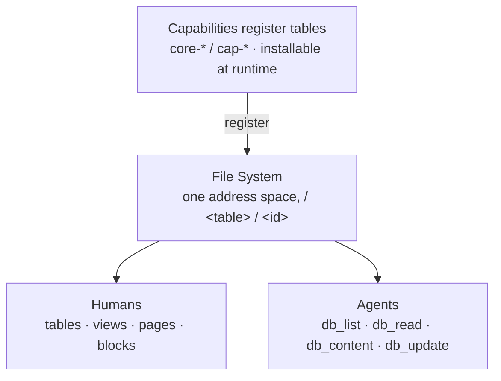
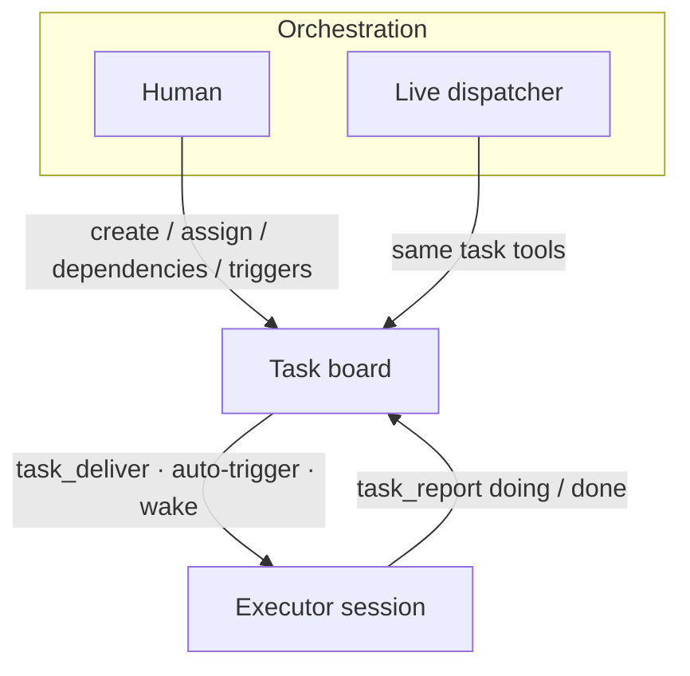
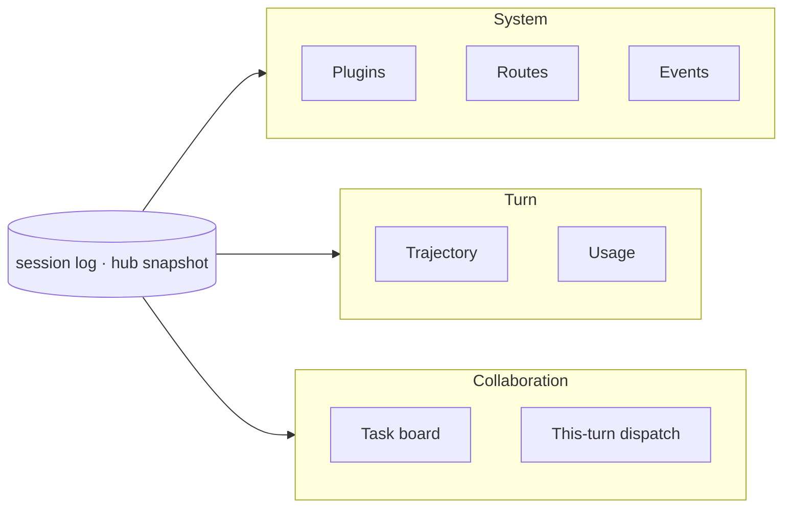
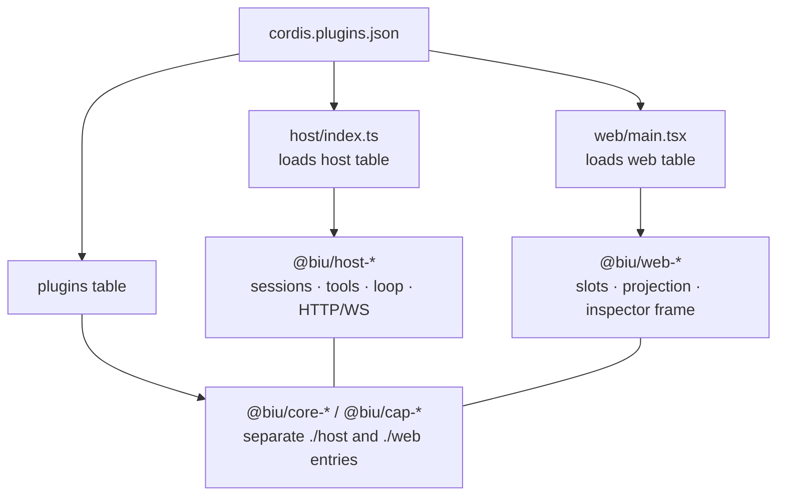

<div align="center">

<p>
  
</p>

# Biu Agent OS

**English** · [简体中文](README.zh-CN.md)

A pluggable, self-hosted agent OS where everything is a file.  

</div>

<p align="center">
  
  
  
  
</p>

**Biu Agent OS** is a local workbench that treats agents as processes, the task board as the bus between them, and **the file system as the shared memory**. Agents run as independent sessions — each with its own workspace, model, and tool set — while a board coordinates multi-agent work. Underneath both sits a workspace-wide **File System**: every table, page, block, view, facet, and plugin is a path, and every path is addressable by both humans and agents. The kernel is Cordis: HTTP, sessions, LLM, chat, the board, and the File System are all plugins loaded from a single manifest, [`cordis.plugins.json`](cordis.plugins.json).

---

## Table of Contents

- [Biu Agent OS](#biu-agent-os)
  - [Design Principles](#design-principles)
  - [The File System](#the-file-system)
    - [Everything is a path](#everything-is-a-path)
    - [Blocks: page content you can install](#blocks-page-content-you-can-install)
    - [Facets: one record, many tables](#facets-one-record-many-tables)
    - [Reverse indexes: collect all data of one kind](#reverse-indexes-collect-all-data-of-one-kind)
    - [Everything is a file: the agent's context](#everything-is-a-file-the-agents-context)
  - [Demo](#demo)
  - [Multi-Agent Collaboration](#multi-agent-collaboration)
  - [Observability](#observability)
  - [Architecture](#architecture)
  - [Repository Layout](#repository-layout)
  - [Quick Start](#quick-start)
  - [License](#license)

---

## Design Principles

| Principle | Core idea |
| --- | --- |
| Everything is a plugin | Kernel and capabilities are decoupled; each capability declares only the services it injects |
| Everything is a file | Tables, pages, blocks, views, plugins all live at paths; one address space for humans and agents |
| Agent-native | Agents govern agents: create, tag, inspect, and dispatch other agents programmatically |
| Multi-agent collaboration | Agents are independent sessions; the task board is the bus between them |
| Full observability | One append-only event stream records every action; every screen is its projection |

### 1. Everything is a plugin

Built on Cordis: each capability declares only the services it injects, and unplugging a capability removes its features — the shell knows slots, not business concepts.

### 2. Everything is a file

A page is a Markdown file; a block inside it is a fenced record; a table is a path; a row is a path; a view, a facet, an installed plugin — all of them are paths served by the same File System. There is no second, human-only data layer: what you click is what the agent reads with `db_list` / `db_read`.

### 3. Agent-native

Agents are first-class objects: an agent can create, tag, inspect, and dispatch other agents programmatically — and it reads the workspace through the same tool surface a human sees.

### 4. Multi-agent collaboration

Each agent is an independent session; the task board is the bus between them. Cards, assignment, dispatch, and `task_report` callbacks all happen on the board.

### 5. Full observability

One append-only event stream records every action; observation and execution share the same source of truth, and every screen is a projection of it. A session is the authoritative log — projection can be swapped, the log cannot be lost.

---

## The File System

The File System is the substrate the whole product sits on. It is not a file browser bolted onto a chat app: it is a **pluggable record layer** where capabilities register their own tables, and everything is exposed to humans (UI) and agents (`db_*` tools) through one contract.



Any capability can register a table; the File System never hard-codes the set. Tasks, pages, sessions, plugins, blocks, facets, saved views, and anything a `cap-*` plugin contributes all appear under the same root.

### Everything is a path

| Path | What it is |
| --- | --- |
| `/` | Root: every registered table (`db_list /`) |
| `/<table>` | A table: its schema, caps, saved views, and rows |
| `/<table>/<id>` | A single record: fields, facets, content, attachments |
| `/<table>/<id>` (content) | The record's **body** — the real file, read/written with `db_content` |
| `/<table>/<id>` (asset) | Attachments the record references — read/written with `db_asset` |

The same paths back the UI: opening a table view, an inspector panel, or a page is navigating that address space. There is no import/export step between "the app's data" and "the workspace's files" — they are the same thing.

**Two layers, one truth.** A page's body is a real Markdown file in `.biu/page/<id>.md` (YAML front matter + body); a SQLite index sits beside it for listing and search. Table rows live in File System SQLite stores. Whatever a capability needs, it stores through the same contract and shows up in the same tree.

### Blocks: page content you can install

Page bodies are Markdown, and Markdown can carry **blocks** — fenced ranges that render as live components:

```md
:::pageBlock {kind=algorithm plugin=page-algorithm}
{
  "title": "1. Two Sum",
  "difficulty": "Easy",
  "prompt": "…",
  "lang": "python",
  "code": "…"
}
:::
```

A block is not a hard-coded widget type. Any installed plugin can call `pageEditor.registerBlock({ kind, plugin, View, … })` and get:

- an entry in the `/` slash menu (its own group, or the built-in "basic" group),
- a rendered component inside the page,
- a record in the `/page-blocks` table (id `<pageId>::<blockId>`), so blocks are queryable and editable **from outside the page** — a block's title, kind, plugin, and data are all fields.

That is the difference from a conventional document editor: content is not a closed blob owned by the editor. Components are installed like plugins, versioned like plugins, and read by agents like any other record. Today's workspace already runs HTML blocks (static + scripted iframes), Excalidraw boards, and algorithm-problem cards this way — none of them are in the repo, all of them are installed.

Editing a block from the agent side is a normal write:

```bash
db_list   /page-blocks                     # every embedded component in the workspace
db_update /page-blocks/<pageId>::<blockId> # patch the block's data (merged by default)
```

### Facets: one record, many tables

A record is a single object, but it rarely belongs to exactly one classification. Tags, categories, awards, project membership — these are the same *record* seen through different lenses.

**Facets** (`/facets`) are workspace-global definitions that can be stamped onto **any** record in **any** table, with per-facet values:

```bash
# one facet: flat values
db_update /movies/dune {tags:["facet-2"], values:{导演:"Denis Villeneuve"}}

# several facets at once: values grouped by facet id
db_update /movies/dune {tags:["facet-2","awards"], values:{"facet-2":{导演:"…"}, awards:{oscar:true}}}
```

A facet has its own schema (`fields`), its own saved views, and its own list of stamped records — and it never steals the record from the table that defined it. One movie can be a "Sci-fi" item, a "2021 releases" item, and an "Oscar winners" item simultaneously, each facet carrying the attributes that only make sense in its own lens.

### Reverse indexes: collect all data of one kind

Two reverse indexes make cross-cutting questions cheap:

- **Facet stamps** — `facet_stamps(facet_id, collection, record_id, title)`: given a facet, return every record anywhere that carries it, without scanning tables. This is what powers "show me everything tagged X" across the whole workspace, and it is the data path behind a facet's member list.
- **Page blocks** — the `/page-blocks` index walks page files and extracts every embedded block into rows (page, block id, kind, plugin, title, data). It only rescans recently-modified pages on each tick and never rebuilds the world, so a page's content is queryable as structured records without re-parsing the workspace.

Both indexes are **derived**: the file (page Markdown, record facets) is the truth, the index is a projection that can be rebuilt. That is why an agent can ask a workspace-level question and get a workspace-level answer.

### Everything is a file: the agent's context

This is the payoff. Because the whole product shares one path space, an agent's context is not assembled by hand — it is read:

| The agent wants to… | It calls |
| --- | --- |
| See what exists | `db_list /` — every table, with a `blurb` written *for the agent* |
| Learn a table's shape | `db_stat /<table>` — schema, caps, available actions |
| Read data | `db_list /<table>`, `db_read /<table>/<id>` |
| Read a body | `db_content /<table>/<id>` |
| Read an attachment | `db_asset /<table>/<id>` |
| Write | `db_create`, `db_update`, `db_delete`, `db_content`, `db_asset` |
| Act | `db_action /<table>/<id>` — declared, per-table verbs |

Two things make this agent-native rather than merely machine-readable:

1. **Tables explain themselves.** Every collection registers a `view.blurb` — prose telling the agent what the table is, which `db_*` to use, what the next common action is, and what *not* to do. `db_list /` is a self-describing map, not a wall of names.
2. **Writes and reads are the same objects the UI shows.** There is no "agent API" with a different shape from the app's own state. What the agent writes is what you see; when you point at something on screen, the selection is a real handle (`kind` + `id` + optional `action`/`plugin`) pointing into the same paths.

The result is a workspace that both parties can navigate: humans click through tables, views, pages, and blocks; agents list, read, and write the same nodes. Context for an agent is the cost of `db_list` + `db_read`, not a bespoke ingestion pipeline.

---

## Demo

Three screens of the same workspace: the task board, and an executor session's trajectory and token usage.

<p align="center">
  
</p>
<p align="center"><sub><code>task.png</code> — Agents report on the board; progress flows back, queue keeps todo/done in sync</sub></p>

<p align="center">
  
</p>
<p align="center"><sub><code>trajectory.jpg</code> — Inspector "Trajectory" reconstructs a full turn from event projection: model output, tool calls, approvals, dispatch</sub></p>

<p align="center">
  
</p>
<p align="center"><sub><code>usage.jpg</code> — Inspector "Usage" shows token consumption; <code>task_report</code> pins the turn's usage</sub></p>

---

## Multi-Agent Collaboration

Executor sessions are independent sessions; the board is the bus between them.



Live handles the **live view** (who is running, whether to wake again); the board handles **work items** (who owns what, where it is stuck, when to dispatch next). Both write into the same File System, so the board is just another table — and tasks can be read, filtered, and driven by `db_*` like everything else.

### First-run flow

1. Open a **Live** session as the dispatcher, plus one or more **chat** sessions as executors.
2. Open **Tasks** in the sidebar, create a card, and assign it to an executor session.
3. A human or the dispatcher calls `task_deliver` — or triggers via cron / `dep:done` / `turn:end` — to wake the executor.
4. The executor runs the task and calls `task_report` each turn: `doing` while in progress, `done` when finished (progress, notes, and turn usage are recorded on the card).
5. Use the inspector to view **Trajectory** and the linked **task** side by side. An upstream `done` can auto-trigger downstream work.

### Humans and agents share one board

| | Human | Agent |
| --- | --- | --- |
| Create card / reassign / inspect blocks | Tasks UI | `tasks_list` · `tasks_update` |
| Assign to a session | Set `assigneeSessionId` | Same; executor must be a real session, not a role name |
| Kick off | Trigger or manual | `task_deliver` |
| Report | Report timeline on board | `task_report` |
| Live steering | Switch to that session | Live: `session_wake` / `session_inject` |

Dependencies form a graph: `parentId` / `dependsOn` derive the blocking chain. Triggers share one state machine: `idle → pending → delivered → done`. Deleting an executor session keeps the card's report history intact.

---

## Observability

The harness answers four questions on its runtime surface — what is loaded, what was dispatched, what this turn did, and where collaboration is stuck — without digging into logs.



| Layer | Question | Entry |
| --- | --- | --- |
| System | Which plugins run, can they be hot-unloaded | Settings → Plugins |
| System | Which HTTP routes does host expose | Settings → Routes |
| System | What Cordis just dispatched | Settings → Events (stream chunks filtered) |
| Turn | What model / tools did step by step | Inspector **Trajectory** (event projection, not a chat copy) |
| Turn | How tokens were spent | Inspector **Usage**; `task_report` pins the turn's cost |
| Collaboration | Who owns which card | Tasks + inspector task page; dispatch table in Live chat |
| Collaboration | Is this tool set valid for the session | Session config / `GET /api/sessions/:id/inspector` |

Plugin (un)load is reflected in the snapshot immediately — plugin table, routes, tool names. The UI only subscribes; it never infers.

---

## Architecture



- **The shell only knows slots.** `composer`, `inspector-panels`, `app-modules`, and Settings panels are `place`d by capabilities. File System and similar pages are cap-registered modules.
- **The agent loop is replaceable.** The `agents` handle stays; the factory can be swapped.
- **The File System is a contract, not a component.** `@biu/type-file-system` defines `CollectionSpec`; `core-file-system` serves it; any capability registers tables against it.
- **Approval sits on the pipeline.** Sensitive tools enter a `hold` state; the approval UI docks without merging into shell logic.

| Table | Loaded by | Hot-unloadable |
| --- | --- | --- |
| `host` | `host/index.ts` | No (kernel) |
| `web` | `web/main.tsx` | No (shell) |
| `plugins` | hub + ui-hub | Yes |

Adding a capability: create `packages/cap-<id>`, split `exports` into `./host` and `./web`, append to the `plugins` table, restart. `type-*` and `public-*` stay out of the table. Details: [docs/plugin-packages.md](docs/plugin-packages.md).

---

## Repository Layout

The root keeps only loaders and the manifest; all capabilities live in `packages/`, distinguished by prefix.

```
biu
├── host/                      # Node loader: reads the host table from json, plugin()
│   ├── index.ts
│   └── types.ts
├── web/                       # Browser loader: reads the web table from json
│   ├── main.tsx
│   ├── style.css
│   └── types.ts
├── index.html                 # Vite entry → web/main.tsx
├── cordis.plugins.json        # Single plugin manifest (host / web / plugins tables)
├── Makefile                   # make / make stop / make restart
├── vite.config.ts
├── LICENSE                    # Apache License 2.0
├── NOTICE.md                  # Apache NOTICE: copyright, grok-bot, third-party packages
├── docs/
│   ├── plugin-packages.md     # Package prefix and entry conventions
│   └── demo/                  # README screenshots: task / trajectory / usage
├── scripts/
│   └── link-cordis-plugins.mjs
├── public/
│   ├── favicon.svg            # Brand mascot on a white square
│   ├── brand-lockup.svg       # README: mascot + Biu Agent OS tag
│   ├── mascot-blue.svg        # README mascots (BMW M tricolor)
│   ├── mascot-violet.svg
│   ├── mascot-red.svg
│   └── grok-bot/              # Not under LICENSE: xAI character geometry replica
└── packages/
    ├── type-session/          # Contracts; not in json
    ├── type-http/
    ├── type-slots/
    ├── type-agent-loop/
    ├── type-host-context/
    ├── type-file-system/      # CollectionSpec: the File System contract
    │
    ├── host-plugin-loader/    # Parses json, Vite virtual modules
    ├── host-http/             # HTTP / WS
    ├── host-session-store/
    ├── host-sessions/         # Append-only session + ALS
    ├── host-tools/
    ├── host-llm/
    ├── host-system-prompt/
    ├── host-fs/
    ├── host-sandbox/
    ├── host-subprocess/
    ├── host-shell/
    ├── host-jobs/
    ├── host-mcp/
    ├── host-terminal/
    ├── host-lsp/
    ├── host-context/
    ├── host-approvals/
    ├── host-agent-loop/
    ├── host-agents/
    ├── host-subagents/
    ├── host-live-sessions/    # Live dispatch (not a task plugin)
    ├── host-hub/              # Mounts plugins table, snapshot
    │
    ├── web-slots/
    ├── web-app-modules/
    ├── web-session-view/
    ├── web-project-view/
    ├── web-snapshot/
    ├── web-react-host/
    ├── web-app-shell/         # App shell, inspector frame
    ├── web-plugin-tree/       # Settings → Plugins
    ├── web-event-log/         # Settings → Events
    ├── web-routes-panel/      # Settings → Routes
    ├── web-ui-hub/
    ├── public-mascot/         # Shared mascot UI; not in json
    ├── public-ui/             # Shared chrome bits; not in json
    │
    ├── core-file-system/      # Serves the File System: tables + db_* tools + UI
    ├── core-editor/           # Record body editor; blocks, mentions, slash menu
    ├── core-plugin-system/    # Installed plugins, install/uninstall, sandbox + pack
    ├── core-task-system/      # Task data, heartbeat, dispatch / report + Task table
    ├── core-chat/             # Sessions table + trajectory / usage
    ├── core-page/             # Pages table + page-block reverse index
    ├── core-pick/             # Point-select data handles
    │
    ├── cap-logger/
    └── cap-mascot-easter-egg/
```

Each `host-*` / `web-*` / `core-*` / `cap-*` source lives under `src/host/` and/or `src/web/`. A `core-*` / `cap-*` package must split `exports["./host"]` and `exports["./web"]` in its `package.json`.

---

## Quick Start

Requires Node.js 20+ and npm. `main` and the dev branch `hmr-dev` are currently aligned.

```bash
git clone https://github.com/helloooooooooooooo97/biu.git
cd biu
make          # installs deps, starts host and Vite
```

| | Address |
| --- | --- |
| UI | http://127.0.0.1:5173 |
| API / WS | http://127.0.0.1:3141 |

Without a configured key, sending a message returns only a local echo. Click **＋ Configure model** next to the input, or:

```bash
export DEEPSEEK_API_KEY=...     # or OPENAI_API_KEY / ANTHROPIC_API_KEY
export CHAT_MODEL=deepseek-chat # optional
```

Once configured, follow the [First-run flow](#first-run-flow) to start a Live session and executors, then create a card in Tasks.

<details>
<summary>Commands and environment variables</summary>

| Command | |
| --- | --- |
| `make` / `make restart` | Install and start both / stop then start |
| `make host` / `make web` | Start one side only |
| `make stop` | Free ports `3141` / `5173` |
| `npm test` | Vitest |
| `npx tsc --noEmit` | Type check |

Alternatively: `npm run dev:host` and `npm run dev:web`.

| Variable | Default | |
| --- | --- | --- |
| `PORT` / `HTTP_HOST` | `3141` / `127.0.0.1` | host listen address |
| `CORDIS_WORKSPACE` | `.workspace` | default workspace |
| `DEEPSEEK_API_KEY` etc. | | or store in the UI only |

</details>

---

## License

Biu-written code and docs in this revision use the [Apache License 2.0](LICENSE):

- **Use, modify, distribute, and commercialize** without a separate grant (no copyleft; you may embed in closed-source products).
- **Patent grant:** each contributor licenses patent claims necessarily infringed by their contribution, so users are not held up by those contributor patents. Filing patent litigation about the Work terminates that grant (Apache-2.0 §3).
- **NOTICE:** keep [NOTICE.md](NOTICE.md) and the license text when you redistribute; mark modified files as changed (Apache-2.0 §4).

Snapshots previously published under MIT or PolyForm Noncommercial stay under those terms. This tree is Apache-2.0 going forward.

**Exception: the Grok Bot.** `public/grok-bot/` — geometry, animation, and character design — is **not** Apache-2.0 Biu source. Rights belong to xAI and other holders. See [NOTICE.md](NOTICE.md).

The software is provided "as is", without warranty of any kind.
