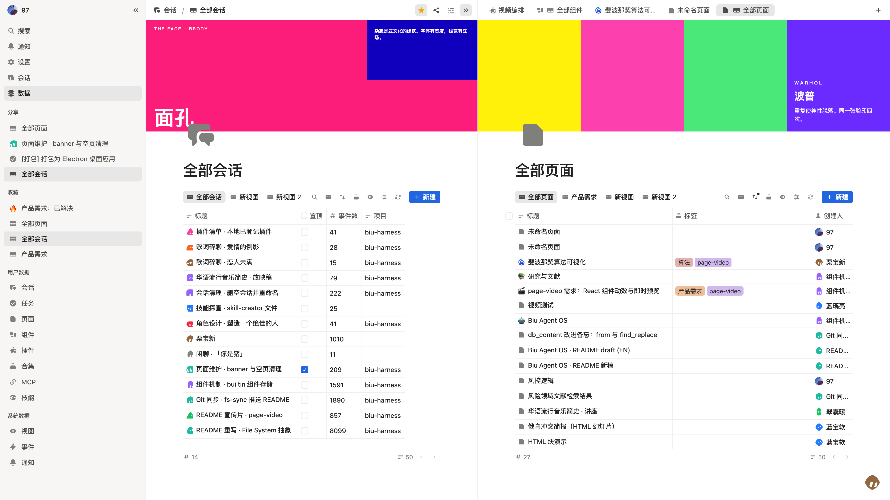
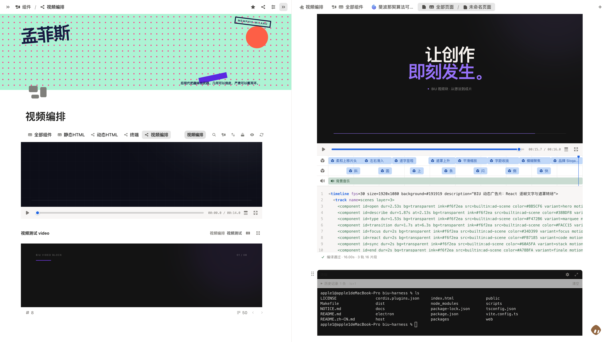
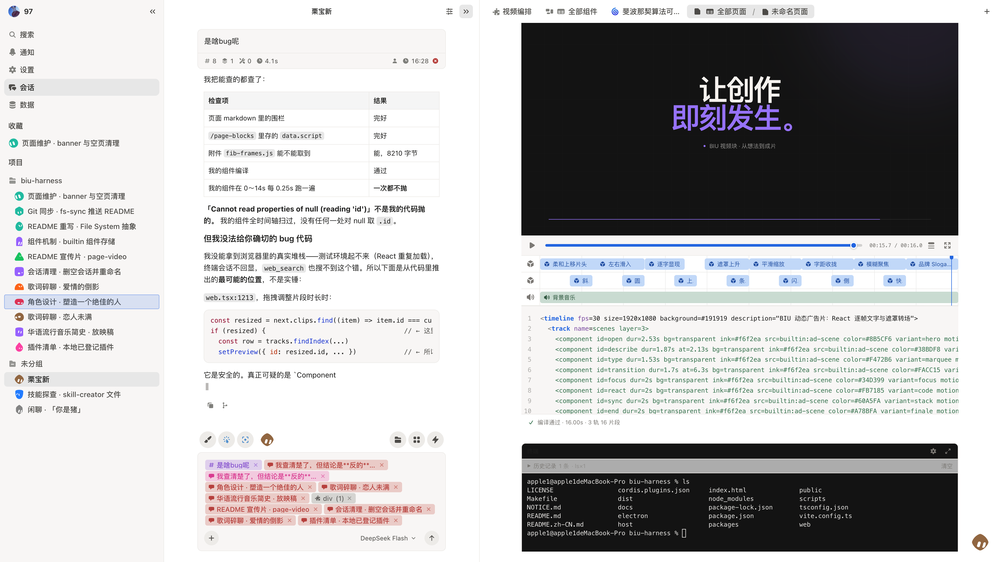
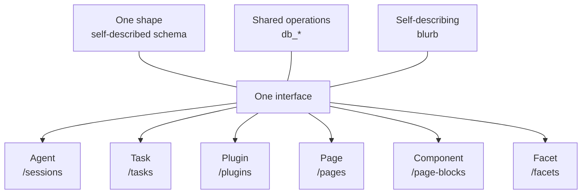
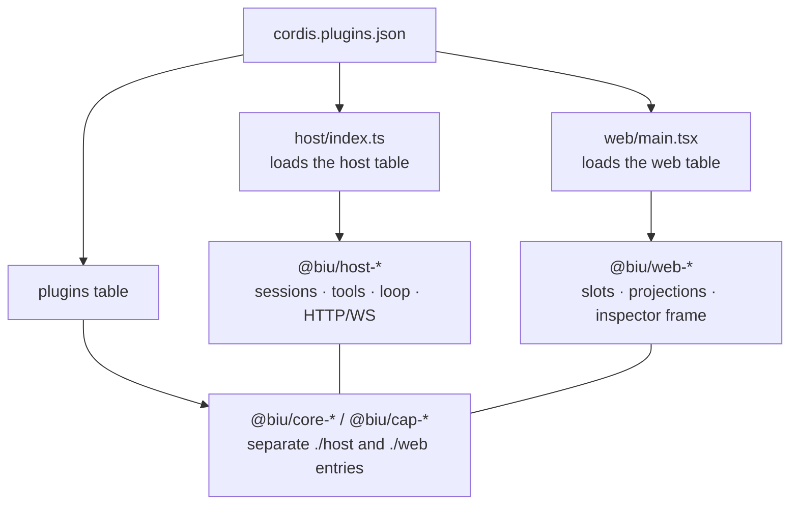

<div align="center">

<p>
  
</p>

# Biu Agent OS

**English** · [简体中文](README.zh-CN.md)

<p>
  <strong>The definitive paradigm for human-AI collaboration.</strong><br />
  <strong>Accelerating how you create, store, compose, distribute, and propagate.</strong>
</p>

<p>
  <em>“McLuhan said the medium is the message.<br />
  In reinventing the ultimate medium, we define the message itself.<br />
  Ask not what Biu can do — ask what Biu cannot.”</em>
</p>

</div>

<p align="center">
  
  
  
  
</p>

---

## Demo

<p align="center">
  
</p>
<p align="center"><sub><code>file-system.png</code> — sessions and pages are ordinary tables in one workspace, with the same controls and address space; split views keep different collections visible side by side</sub></p>

<p align="center">
  
</p>
<p align="center"><sub><code>component.png</code> — a page composes reusable video blocks; the same component opens in a dedicated editor with its preview, timeline, source declaration, and terminal</sub></p>

<p align="center">
  
</p>
<p align="center"><sub><code>context.png</code> — pages, sessions, plugins, and other workspace items become removable context chips in the composer, so the agent receives exactly the material selected for the conversation</sub></p>

---

## Why a File System?

Most agent products separate conversations, content, and tools across different systems. Agent output remains in chat history, so using it again means finding, explaining, or generating it again.

Biu puts pages, tables, tasks, skills, plugins, and agents themselves in one workspace. Humans use the interface, while agents read and modify the same data through a shared API. There is no second copy to keep in sync.

This shared data and operation model is the **File System**. It is not a file browser bolted onto an app; it is the foundation of the workbench. Every table, page, block, and record has an addressable path.

As Picasso famously said, "Good artists copy, great artists steal." Rather than copying surface features, Biu draws foundational models from four classic systems and recombines them into its own core architecture:

| Borrowed from | What |
|---|---|
| **Linux** | The kernel model — everything is a path, one set of system calls (`db_action` is to `ioctl` what `blurb` is to `/proc`) |
| **K8s** | Declarative — a block declares a desired state, a plugin is mountable |
| **Cursor** | Agent-native — and one step further: the agent itself is data |
| **Notion** | The block model — except block types come from installable plugins rather than a closed set of built-in components |

> In implementation, the kernel is built on [Cordis](https://github.com/cordiverse/cordis), and plugin registration is managed through a single manifest, [`cordis.plugins.json`](cordis.plugins.json). Plugins register new tables and capabilities; the File System provides the shared data model and operation interface across the workbench.

---

## Table of contents

- [Demo](#demo)
- [Why a File System?](#why-a-file-system)
  - [Design lineage](#design-lineage)
- [Design principles](#design-principles)
  - [1. Few atoms, many combinations](#1-few-atoms-many-combinations)
  - [2. One abstraction, one entry point](#2-one-abstraction-one-entry-point)
- [1. What it abstracts](#1-what-it-abstracts)
  - [One shape](#one-shape)
  - [One operation interface](#one-operation-interface)
  - [Self-describing semantics](#self-describing-semantics)
- [2. So everything is an instance of it](#2-so-everything-is-an-instance-of-it)
  - [Agents: one operator model for humans and agents](#agents-one-operator-model-for-humans-and-agents)
  - [Tasks: the bus between agents](#tasks-the-bus-between-agents)
  - [Plugins: the system extends itself the same way](#plugins-the-system-extends-itself-the-same-way)
  - [Pages: the container for components](#pages-the-container-for-components)
  - [Components: declarative content units](#components-declarative-content-units)
  - [Facets: dimensions become data](#facets-dimensions-become-data)
  - [Second-class objects: the same interface, a smaller surface](#second-class-objects-the-same-interface-a-smaller-surface)
- [3. Transparent: files are the floor, not a cage](#3-transparent-files-are-the-floor-not-a-cage)
- [4. What that gets you](#4-what-that-gets-you)
  - [Creation is not reserved for developers](#1-creation-is-not-reserved-for-developers)
  - [Context is injected precisely](#2-context-is-injected-precisely-not-guessed)
  - [Declarative: writing a desired state](#3-declarative-an-agent-can-write-a-desired-state-not-just-call-commands)
  - [Content carries its dependencies](#4-content-carries-its-dependencies-what-you-share-is-a-runnable-unit)
  - [It is a kernel, not an application](#5-it-is-a-kernel-not-an-application)
- [5. What it solves](#5-what-it-solves)
  - [Context injection: no more guessing](#1-context-injection-no-more-guessing)
  - [Saving tokens: reuse instead of regenerate](#2-saving-tokens-reuse-instead-of-regenerate)
  - [Self-improvement: what is valuable settles](#3-self-improvement-what-is-valuable-settles)
- [Quick start](#quick-start)
- [Architecture](#architecture)
- [Repository layout](#repository-layout)
- [License](#license)

---

## Design principles

Now that the product is concrete, two principles explain its design: one limits **the number of abstractions**, while the other unifies **how they are used**.

### 1. Few atoms, many combinations

The anti-pattern is a one-to-one mapping between concepts and features — a "task" concept for tasks, a "document" concept for documents, a "chat" concept for chat. N features, N mechanisms; adding a feature means adding a concept.

Biu's set of atoms is small:

```
path · table · record · schema · operations · blurb
```

Everything else is composed out of those six: tasks, pages, skills, plugins, facets, components, sessions, events…

So **adding a domain is not adding a concept — it is composing the same atoms once more.**

### 2. One abstraction, one entry point

Few atoms are not enough on their own — if every domain had its own access pattern, humans and agents would still have to learn it N times.

Biu exposes one operation interface for reading and writing data in any domain:

```
db_create /<table>
db_update /<table>/<id>
db_list   /<table>
...
```

The commands and calling convention stay the same; only the table path changes. **Adding a domain does not require another API.** An agent can use `db_stat` to inspect a table's structure and capabilities, then read or write it with the common operations.

### The two together

```
few atoms  +  one entry point
    ↓
adding a capability needs neither a new concept nor a new way of using the system
    ↓
so a capability can be data, and an agent can extend an agent
```

This principle shows up again and again below, always as the same move:

| Case | What was done |
|---|---|
| Facets | no new schema mechanism — reuse "table" |
| Page environment | no new `env` field — reuse "attributes" |
| Component composition | components are finite atoms; pages are unlimited recipes |
| Skill files | no new attachment mechanism — reuse a directory plus one read-only derived field |

> **Note: this is not "the system is simple."** The concepts still have to be learned — path, table, record, facet, component, blurb, projection.
> It says something else: **neither the number of concepts nor the number of interaction patterns grows with the number of features.**

---

## 1. What it abstracts

In most systems, "read and write data" gets written once per domain: one API for tasks, another for documents, another for config. A new domain means a new set of endpoints, and every consumer of that interface — UI, agents, scripts — has to learn it again.

Biu collapses that layer into a single **File System**. What it abstracts is not storage — underneath, SQLite is SQLite, a file is a file — **it abstracts the interface**:

> Data in every domain follows the same structure, operation interface, and form of self-description.

Adding a capability therefore doesn't touch the layers above. **Register a table, and it is as readable, writable, and queryable as every table that already exists.**

### One shape

Every table describes its own schema. An agent doesn't need to know in advance what `/skills` looks like:

```
db_stat /skills
  → fields:  title / description / enabled / source / fileList / notes …
  → caps:    list, read, update, create, delete, content
  → actions: enable, disable
```

Field names, types, writability, available actions — all in one call. **No hardcoded domain knowledge.**

### One operation interface

The same `db_*` operations apply to every table:

| You want to… | Operation |
|---|---|
| See what exists | `db_list /` |
| See a table's shape | `db_stat /<table>` |
| Read data / read a row | `db_list /<table>` · `db_read /<table>/<id>` |
| Read the body | `db_content /<table>/<id>` |
| Write | `db_create` · `db_update` · `db_delete` · `db_content` |
| Run a domain action | `db_action /<table>/<id>` |

That last one matters: **domains can define their own actions**. `/tasks` has `deliver` (dispatch) and `report`; `/plugins` has `sandbox` and `pack`. These actions are not built into the File System — **each table declares its own** — yet they are invoked through the same interface.

### Self-describing semantics

A shared structure and operation interface are not enough on their own. Given `/tasks` and `/skills`, how does an agent know which to use?

**The table says so.** Every collection registers a `view.blurb` — prose that says what this table is, which `db_*` to use, what the common next action is, and what **not** to do.

```
$ db_list /
/events      Session timeline log. Each row is one seq within a session. Read-only.
/tasks       Read-write task rows. Assignee is the session id of another agent …
/skills      Skills are their own table. Install from GitHub: db_create /skills with files[] …
/plugins     These are plugins (installable mini-programs), not agents. If the user says
             "spin up another agent", go to /sessions db_create — do not create here.
```

Note that last one — it **proactively corrects a misunderstanding**. That is the real job of `blurb`: not documentation, but **operating instructions for an agent**.

> **A shared structure lets an agent read. A shared operation interface lets it act. Self-describing semantics tell it what to do.**

---

## 2. So everything is an instance of it

Because the interface is uniform, agents, tasks, pages, skills, and plugins are not merely modules that use the File System — they are **records within it**.



Each one answers the same three questions: **what is it, how does a human use it, how does an agent use it.**

### Agents: one operator model for humans and agents

Every row in `/sessions` is an agent — an independent session with its own workspace, model, and tool set.

> **An agent is not a consumer of the file system; it is an instance inside it.**
> It reads other objects through the same `db_*` interface, and other objects use that interface to read it.

That single fact determines the shape of the product: **you can operate on agents the way you operate on data.** Spinning up an agent = `db_create /sessions`. Dispatching a task = writing another session's id into `assignee`.

```
$ db_list /sessions                       # every agent in the workspace
$ db_action /sessions/<id> action=inspect # its config and last few messages
$ db_action /sessions/<id> action=status  # how much context it has used
```
### Tasks: the bus between agents

```
/tasks
  status · assignee · dependsOn · reports …
  actions: deliver (dispatch) · report (check in)
```

A human creates cards, assigns them, and watches for blockers through the UI; an agent dispatches and reports through the same table. **Both operate on the same data through the same interface.**

Dependencies are a graph derived from `parentId` / `dependsOn`; triggers share one state machine, `idle → pending → delivered → done`. An upstream `done` can auto-trigger downstream.

| | Human | Agent |
|--|--|--|
| Create card / reassign / see blockers | Tasks UI | `tasks_list` · `tasks_update` |
| Dispatch to a session | assign `assigneeSessionId` | same; the worker must be a real session, not a role name |
| Start work | trigger or manual | `task_deliver` |
| Report back | report timeline on the board | `task_report` |
### Plugins: the system extends itself the same way

`/plugins` is another table registered through the same interface, with one record per plugin. Installed (`.plugin`) and in-development (`.plugin-dev`) entries sit side by side, and **plugin development and packaging follow one path: `sandbox` → write code → `pack`**.

```
$ db_action /plugins/<id> action=sandbox   # create .plugin-dev/<id>/
$ db_action /plugins/<id> action=pack      # build into .plugin/
```

This is a deliberate constraint: **installing something into the system goes through the same interface too.**
### Pages: the container for components

A component declares what it is, but *where it sits, in what order, and alongside what* is decided by the page. And **the page is the only unit in this system that has boundaries**:

| Boundary | Meaning |
|---|---|
| **Logical** | A block's id is `<pageId>::<blockId>`, namespaced by construction — same-named blocks on different pages never collide |
| **Organisational** | Order, layout, context — a page is one experiment, one lesson, one project |
| **Delivery** | Sharing resolves dependencies page by page, packing the plugin source along with it |
| **Environment** | The page supplies a scoped set of variables to the plugins inside it — one plugin, different behaviour per page |

The third boundary is the most concrete: **a component on its own is not yet a deliverable; the page turns it into a self-contained, runnable unit.**

The fourth boundary has the deepest effect: **different pages create naturally isolated scopes, making them suitable tenant boundaries.**

```
one plugin (one implementation)
    ↓ mounted on different pages
/page A  title: Intro drills      tags: [easy, python]
/page B  title: Algorithm sprint  tags: [hard, rust]
    ↓
two behaviours, no second implementation
```

**A page's own attributes are its environment** — there is no separate `env` field to add. `title`, `tags`, `emoji`, and whatever else the page needs are themselves the shared environment variables of the plugins inside it:

```yaml
---
title: My workbook
tags: [drills, hashing]
emoji: 📘
---
```

A plugin reads the attributes of the page it sits on, so a component is not a copied implementation — it is **one implementation parameterized by its environment**. This is page-level tenant isolation, not merely a configuration difference: the page boundary defines the scope, rather than a property on the plugin. The mechanism needs nothing new; it follows directly from "everything is data."

Both layers are declarative:

```
Component  declares "what"        kind + plugin + data
Page       declares "how"         the order of the fences + the prose around them
Page       declares "which env"   its own attributes
```

The system turns both declarations into a functioning interface. So **a whole page is itself a declaration** — for an agent, making a page means writing a declaration, not building an interface.

That is also why composition doesn't explode: **components are a finite set of atoms; pages are an unlimited set of recipes.**

Page bodies live in SQLite; attachments share one tree with two layers:

```
.biu/biu.sqlite       ← pages, tasks, sessions, facets, views
.biu/events.sqlite    ← session event log
.biu/assets/          ← attachments
```

Markdown can carry **blocks** — a fenced section that renders as a live component:

```md
:::pageBlock {kind=algorithm plugin=page-algorithm}
{ "title": "1. Two Sum", "lang": "python", "code": "……" }
:::
```

Any installed plugin can register a block type, and gets three things: an entry in the slash menu, a component rendered in the page, **and a row in the `/page-blocks` table**.

That last one is the dividing line: **content is not an opaque text blob owned by the editor.** Block types are installed with plugins, while blocks themselves are read and edited by agents like ordinary records. The HTML blocks already running in this workspace (static content and iframes that execute scripts), Excalidraw boards, and algorithm cards are installed at runtime rather than shipped in the repository.

### Components: declarative content units

A **block** inside a page (`/page-blocks`) is a Component. It is three things at once:

| Layer | What it is |
|---|---|
| How it is written | A declaration: `kind` is the type, `plugin` says who renders it, and the rest is data |
| How it renders | A live component in the page — implemented by a plugin, installed and versioned like one |
| As data | A row in `/page-blocks`: `pageId` · `blockId` · `blockKind` · `plugin` · `data` |

The third layer is the key one: because a block is also a record, it can be read, written, queried, and aggregated from outside the page.

```
$ db_list   /page-blocks                        # every embedded component in the workspace
$ db_update /page-blocks/<pageId>::<blockId>    # change a block's data (merged by default)
```

**Aggregating across pages**: every block record carries `plugin` and `pageId`, so one query can show where and how widely a component type is used:

```
$ db_list /page-blocks filter.plugin=page-algorithm
  → every block in every page rendered by that plugin
```

That is what it means for components to be first-class objects: **they do not only live inside one page — they are a category of workspace data that can be aggregated.** And because they are declarative, an agent does not need to write UI code — three fields are enough.

### Facets: dimensions become data

In every section above, the schema was defined by plugin code. But some dimensions emerge **while the system is running**. Whether a movie needs a "director" or a task needs a "quarterly rating" depends on the current use case; adding either dimension should not require a new plugin.

`/facets` flips this around: **a dimension is itself a row in a table.**

```bash
db_create /facets records=[{title:"Awards"}]                   # a new dimension, zero code
db_update /facets/Awards {fields:[{key:"name",type:"string"},  # the dimension carries its own schema
                                  {key:"year",type:"number"}]}

db_update /movies/dune {tags:["Awards"], values:{name:"Oscar",year:2022}}
db_update /tasks/build {tags:["Awards"], values:{name:"Q4 best",year:2022}}
```

Three consequences:

1. **A new dimension needs no code change and no migration.**
2. **One facet spans every table** — the same "Awards" can be attached to a movie, a task, or a page.
3. **A record never leaves the table that defines it.** One movie can be both a "Sci-fi" item and a "2021 release" item, each lens carrying properties that only make sense under that lens.

This makes the division of labour between the two kinds of schema explicit:

| | Defined in | Responsible for |
|---|---|---|
| A table's schema | plugin code (static) | **Structure** — what this thing is |
| A facet's schema | data (dynamic) | **Lens** — how you look at it right now |

> **"Unlimited extension" does not mean the File System knows every dimension in advance. It means it lets dimensions appear at runtime, as data.**

The facet index (`facet_stamps`) makes "give me everything tagged X" cheap instead of a table scan: given one facet, it returns every record in the workspace carrying it. It is a derived index, rebuildable at any time.

### Second-class objects: the same interface, a smaller surface

Beyond the first-class objects, a few more tables sit under the root. They introduce no new mechanism — they are more instances of the same interface. **Registering a table is how you add a domain**, and that is the abstraction doing its job.

| Table | What it is |
|---|---|
| `/skills` | Skill packs. One record (metadata + body) plus one directory (the files a skill ships with). `SKILL.md` becomes the body, the rest lands in `.biu/skill/<id>/`, and the on-disk state is exposed as the read-only field `fileList` — **three kinds of storage, one interface** |
| `/mcp` | External tool sources. One row = one MCP server; its tools are reached through `mcp_list` / `mcp_call` rather than becoming separate tools |
| `/views` | Saved queries. Filters, sorts, and complex conditions (`filterTree`) all persist as a row |
| `/events` | Session timelines. Append-only, read-only |
| `/notices` | An inbox for humans |

`/skills` and `/mcp` are here not because they matter less, but because they **introduce no new mechanism** — they are applications of the rule "register a table", not the rule itself.

---

## 3. Transparent: files are the floor, not a cage

At this point a fair question: if what's underneath is SQLite, directories, and logs, why call it a **file** system?

Because the abstraction **never locks data behind the interface**.

```
/pages/abc    →  .biu/biu.sqlite               pages.notes
/skills/bento →  .biu/skill/bento/DESIGN.md   really cats out of the filesystem
```

You can use only `db_*`, or read the disk directly. **The abstraction is a convenience, not a barrier.**

This clarifies what "everything is a file" means. It is not a literal description of the underlying storage, which remains heterogeneous; it describes a **property**: data is available through one interface while remaining directly visible on disk.

Page bodies live in `.biu/biu.sqlite` (`pages.notes`); session events live in `.biu/events.sqlite`. Attachments share `.biu/assets`. Table rows live in the same biu database. A capability stores whatever it wants, under the same contract, and it shows up in the same tree.

**Transparency buys one more thing: traceability.** An append-only event stream records every action, and every surface is a projection of it. The session log is authoritative — projections can be swapped; the log cannot be lost. Because you can see both the state and how it came to be, you never have to distrust the abstraction layer.

---

## 4. What that gets you

The previous sections traced one chain: a single interface, and everything as an instance of it. Follow that chain to the end and this is what grows out of it.

### 1. Creation is not reserved for developers

This is the most direct consequence. Because everything is a row in a table, and an agent can write to any table:

```
db_create /sessions   ← make an agent
db_create /tasks      ← make a task
db_create /pages      ← make a page of content
db_create /skills     ← make a skill
db_create /facets     ← make a dimension
db_create /plugins    ← make a capability (the only one needing pack, because it is code)
```

**Same operations, same syntax, only the table name differs.**

In most systems, extending the system and using it are two separate roles: developers write plugins, while users install them. Biu does not impose that division — **humans and agents can create system objects through the same interface.**

The system's boundary is therefore not limited to features that developers built in advance; it also includes capabilities created at runtime. The `plugins` collection must be a table to close this loop: if only developers could write plugins, agents would remain limited to capabilities provided in advance.

### 2. Context is injected precisely, not guessed

Humans and agents share one address space, so **the surface you perceive is the surface you act on**:

```
human acts on a page ──→ state changes ──→ agent reads it with the same db_*
agent changes state  ──→ UI renders     ──→ human sees it
```

An agent is not "notified" of a human's actions — it **reads the results those actions left behind**, and the picture is complete, because both sides use the same paths. What you click on screen is a real handle (`kind` + `id`, optionally `action`/`plugin`), not merely a rendering artifact.

That makes context injection stop being a guessing game about what to stuff in:

| It wants to know | Read from |
|---|---|
| Where am I | the current page / record / selected block |
| What am I doing | block data, record fields, task status |
| Why am I here | `assignee` / `dependsOn` / `reports` |
| What happened before | `/events` |
| Who else is around | `/sessions`, the collaboration graph in `/tasks` |

**The cost scales with the data that actually needs to be read, not with all available data.** There is no bespoke ingestion pipeline and no second copy maintained solely for agents to understand.

### 3. Declarative: an agent can write a desired state, not just call commands

A block inside a page is a declaration:

```md
:::pageBlock {kind=algorithm plugin=page-algorithm}
{ "title": "1. Two Sum", "lang": "python", "code": "……" }
:::
```

`kind` and `plugin` say who renders it; the JSON that follows is the data it wants. The system converges that into a real, running component in the UI.

**Because it is declarative, an agent can simply write it** — no rendering API to call, just a desired state to write down. Plugins work the same way: installable, replaceable, `sandbox` → write code → `pack`.

So an agent has two kinds of action: **calling commands** (`db_action`) and **writing declarations** (`db_create` / `db_update`). The latter is what lets it build things.

### 4. Content carries its dependencies: what you share is a runnable unit

A page holds several blocks, each block comes from a plugin, and a plugin is code. So sharing a page takes more than content along with it:

```
the page body (Markdown)
its attachments
the plugin source it references   ← packed along with it
```

The recipient gets not "a document" but **a self-contained unit that runs**.

The dependency chain spans three stages: **declare** when writing (a block names its `plugin`), **resolve** when sharing (scan references and package them), and **mount** when running (install the plugin and render the block).

This is also why `.plugin-dev` and `.plugin` sit side by side in the same table — **a plugin has to be a peer of the data in order to travel with it**.

### 5. It is a kernel, not an application

Put all of this back into a known coordinate system and its shape becomes clear:

| | Linux | Biu |
|---|---|---|
| Everything is a path | everything is a file | everything is `/<table>/<id>` |
| System calls | `read` / `write` | `db_read` / `db_update` |
| Device-specific operations | `ioctl` | `db_action` |
| Self-reported system state | `/proc` | `db_list /` + `blurb` |
| Driver registration | modules | the plugin registry |
| Hiding heterogeneity | VFS | File System |

**It is not an agent application; it is a kernel that agent applications can grow out of.**

Cursor put an agent inside an editor, and Notion put blocks inside a document — their core objects are predefined by their respective applications. Biu's core objects are data themselves: **an agent is data, a capability is data, and an agent created by another agent is data too**, so all of them can be read, written, copied, and shared.

That also explains why it has to exist — there can be many applications (a writing desk, a dispatch desk, an algorithm workbook), but **they can all share one kernel**.

---

## 5. What it solves

The agent field has a few problems it has never really settled. This design answers them in one move — and the answers **hold for humans just as well**.

### 1. Context injection: no more guessing

"What should the agent see?" is one of the most expensive questions in any agent system. Common approaches retrieve large amounts of potentially relevant material, rely on manually configured rules, or push events directly, but they often fail to provide the right context.

Biu has two sources, neither of which is a guess.

**First, capabilities register their own context.** Context is not generated centrally by the platform; each capability declares and provides it through the same contract: a block, a table, or a tool. **It follows the same pattern as registering a table**: whoever provides a capability also states what context it contributes.

**Second, environmental awareness.** An agent and a human read the same address space, so the agent can see what the human is doing:

```
human acts on a page ──→ state changes ──→ agent reads it with the same db_*
```

Not notified — **able to read the results the action left behind**.

> → **For humans**: no re-explaining the background every time. The context is on the page; read where you write.

### 2. Saving tokens: reuse instead of regenerate

In most agent products, having an agent produce a UI means having it write a hundred-odd lines of HTML / CSS / JS. Expensive, usually ugly, and it will be written again next time.

In Biu, having an agent produce a UI means writing three fields:

```md
:::pageBlock {kind=algorithm plugin=page-algorithm}
{ "title": "1. Two Sum", "lang": "python" }
:::
```

`kind` and `plugin` point at a plugin that already exists; all that is left is data. **One plugin, reused across N pages.**

> → **For humans**: iterating on a page is roughly editing a JSON blob, not writing a page from scratch.

### 3. Self-improvement: what is valuable settles

A valuable output from an ordinary agent usually sinks into the chat log and disappears — the next time, the agent generates it all over again.

In Biu it can **settle**: it becomes a page, a block, a skill, a table. Because everything is data, settling needs no extra machinery — it is just an ordinary write.

The system therefore grows round after round instead of resetting to zero each time.

> → **For humans**: what you write stays in the same place. **Humans and agents share the same accumulated knowledge** — what you teach an agent today remains available tomorrow, and you can see where it lives.

---

## Quick start

Requires Node.js 20+ and npm. `main` and the development branch `hmr-dev` are currently aligned.

macOS / Windows installers are on [GitHub Releases](https://github.com/helloooooooooooooo97/biu/releases). macOS is ad-hoc signed: if Gatekeeper says the app is damaged, run:

```bash
xattr -dr com.apple.quarantine /Applications/Biu.app
```

See [docs/desktop-install.md](docs/desktop-install.md).

```bash
git clone https://github.com/helloooooooooooooo97/biu.git
cd biu
make          # install dependencies, start both host and Vite
```

| | Address |
|--|------|
| UI | http://127.0.0.1:5173 |
| API / WS | http://127.0.0.1:3141 |
| LAN read-only share | `http://<LAN-IP>:3142/share/...` (the workbench itself stays on localhost) |

Without a key configured, sending a message only returns a local echo. Click **+ Configure model** next to the composer, or:

```bash
export DEEPSEEK_API_KEY=...     # or OPENAI_API_KEY / ANTHROPIC_API_KEY
export CHAT_MODEL=deepseek-chat # optional
```

On the first run:

1. Open a **Live** session as the dispatcher and one or more **chat** sessions as workers.
2. Open **Tasks** from the sidebar, create a card, and assign it to a worker session.
3. Dispatch the task manually or from the dispatcher to wake the worker, then have the worker report progress after each turn.
4. Use the inspector on the right to view the execution **trajectory** alongside the corresponding **task**.

<details>
<summary>Commands and environment variables</summary>

| Command | |
|------|--|
| `make` / `make restart` | install and start both sides / stop first, then start |
| `make host` / `make web` | start one side only |
| `make stop` | release `3141` / `3142` / `5173` |
| `npm test` | Vitest |
| `npx tsc --noEmit` | type check |

Also: `npm run dev:host` and `npm run dev:web`.

| Variable | Default | |
|------|------|--|
| `PORT` / `HTTP_HOST` | `3141` / `127.0.0.1` | local workbench (do not set `0.0.0.0`, or the entire workbench becomes accessible on the LAN) |
| `SHARE_PORT` / `SHARE_HOST` | `3142` / `0.0.0.0` | opened by default by `make` / `npm run dev`; serves share pages only. `SHARE_PORT=0` disables |
| `SHARE_PUBLIC_URL` | auto-detected LAN IPv4 | origin used for copied links, e.g. `http://192.168.1.8:3142` |
| `SHARE_PROXY_UI` | `dev:host` points at Vite | share pages use `5173` in dev; `npm start` uses the build output |
| `CORDIS_WORKSPACE` | `.workspace` | default workspace |
| `DEEPSEEK_API_KEY` etc. | | can also be stored in the UI only |

</details>

---

## Architecture



- **The shell depends only on slots.** Capabilities place `composer`, `inspector-panels`, `app-modules`, and each Settings section themselves. Pages such as File System are modules registered by capabilities.
- **The agent loop is replaceable.** The `agents` handle stays; the factory can change.
- **File System is a contract, not a component.** `@biu/type-file-system` defines `CollectionSpec`; `core-file-system` provides the implementation; any capability registers tables against it.
- **Approvals sit on the pipeline.** Sensitive tools enter a hold state, and the approval UI docks — it is not folded into shell logic.

| Table | Loaded by | Hot-unloadable |
|----|--------|----------|
| `host` | `host/index.ts` | no (kernel) |
| `web` | `web/main.tsx` | no (shell) |
| `plugins` | hub + ui-hub | yes |

To add a capability, create `packages/cap-<id>`, define separate `./host` and `./web` exports, register it in the `plugins` table, and restart. Do not register `type-*` or `public-*` packages in that table. See [docs/plugin-packages.md](docs/plugin-packages.md) for details.

---

## Repository layout

The root holds only loaders and the manifest; every capability lives under `packages/`, distinguishable by prefix.

```
biu
├── host/                      # Node loader: reads the host table from json, plugin()
│   ├── index.ts
│   └── types.ts
├── web/                       # Browser loader: reads the web table from json
│   ├── main.tsx
│   ├── style.css
│   └── types.ts
├── index.html                 # Vite entry → web/main.tsx
├── cordis.plugins.json        # the only plugin manifest (host / web / plugins)
├── Makefile                   # make / make stop / make restart
├── vite.config.ts
├── LICENSE                    # Apache License 2.0
├── NOTICE.md                  # Apache NOTICE: copyright, Grok Bot, third-party deps
├── docs/
│   ├── plugin-packages.md     # package prefixes and entry conventions
│   ├── desktop-install.md     # unsigned macOS / Windows installers
│   └── demo/                  # README screenshots: file-system / component / context
├── scripts/
│   └── link-cordis-plugins.mjs
├── public/
│   ├── favicon.svg            # brand mark (white square)
│   ├── brand-lockup.svg       # README: mark + Biu Agent OS tag
│   ├── mascot-blue.svg        # README mascots (BMW M palette)
│   ├── mascot-violet.svg
│   ├── mascot-red.svg
│   └── grok-bot/              # NOT under LICENSE: geometric copy of an xAI character
└── packages/
    ├── type-session/          # contracts, not in json
    ├── type-http/
    ├── type-slots/
    ├── type-agent-loop/
    ├── type-host-context/
    ├── type-file-system/      # CollectionSpec: the File System contract
    │
    ├── host-plugin-loader/    # parses json, Vite virtual modules
    ├── host-http/             # HTTP / WS
    ├── host-session-store/
    ├── host-sessions/         # append-only session + ALS
    ├── host-tools/
    ├── host-llm/
    ├── host-system-prompt/
    ├── host-fs/
    ├── host-sandbox/
    ├── host-subprocess/
    ├── host-shell/
    ├── host-jobs/
    ├── host-mcp/
    ├── host-terminal/
    ├── host-lsp/
    ├── host-context/
    ├── host-approvals/
    ├── host-agent-loop/
    ├── host-agents/
    ├── host-subagents/
    ├── host-live-sessions/    # Live dispatch (not a task plugin)
    ├── host-hub/              # mounts the plugins table, snapshots
    ├── host-skills/           # /skills table: skill packs + file directories
    │
    ├── web-slots/
    ├── web-app-modules/
    ├── web-session-view/
    ├── web-project-view/
    ├── web-snapshot/
    ├── web-react-host/
    ├── web-app-shell/         # app shell, inspector frame
    ├── web-plugin-tree/       # Settings → Plugins
    ├── web-event-log/         # Settings → Events
    ├── web-routes-panel/      # Settings → Routes
    ├── web-ui-hub/
    ├── public-mascot/         # shared mascot UI, not in json
    ├── public-ui/             # shared parts (fold/count/menu/attachments), not in json
    │
    ├── core-file-system/      # File System: tables + db_* tools + UI
    ├── core-editor/           # record body editor; blocks, refs, slash menu
    ├── core-plugin-system/    # installed plugins, install/uninstall, sandbox + pack
    ├── core-task-system/      # task data, heartbeat, dispatch / report + task table
    ├── core-chat/             # session table + trajectory / usage
    ├── core-page/             # page table + page-block reverse index
    ├── core-pick/             # picked-data handles
    │
    ├── cap-logger/
    └── cap-mascot-easter-egg/
```

Every `host-*` / `web-*` / `core-*` / `cap-*` package keeps its source under `src/host/` and/or `src/web/`. `core-*` / `cap-*` packages must declare `exports["./host"]` and `exports["./web"]` separately.

---

## License

As of this version, **code and documentation original to the Biu Agent OS project** are licensed under the [Apache License 2.0](LICENSE):

- **Free to use, modify, distribute, and commercialize**, with no copyleft — it can be embedded in closed-source products, with no separate commercial license required.
- **Patent grant:** contributors grant the patent licenses necessary to use their contributions; if you bring a patent suit over this work, that patent license terminates (Apache-2.0 §3).
- **NOTICE obligation:** redistribution must retain [NOTICE.md](NOTICE.md) and the license text; modified files must be marked as changed (Apache-2.0 §4).

Snapshots previously released under MIT or PolyForm Noncommercial remain under those terms. The current repository tree and all subsequent releases are licensed under Apache-2.0.

**Exception: the Grok Bot character.** The geometry, animation, and character design in `public/grok-bot/` are **not part of the Biu source licensed under Apache-2.0**; rights belong to xAI and other rights holders. See [NOTICE.md](NOTICE.md).

The software is provided "as is", without warranty of any kind.
