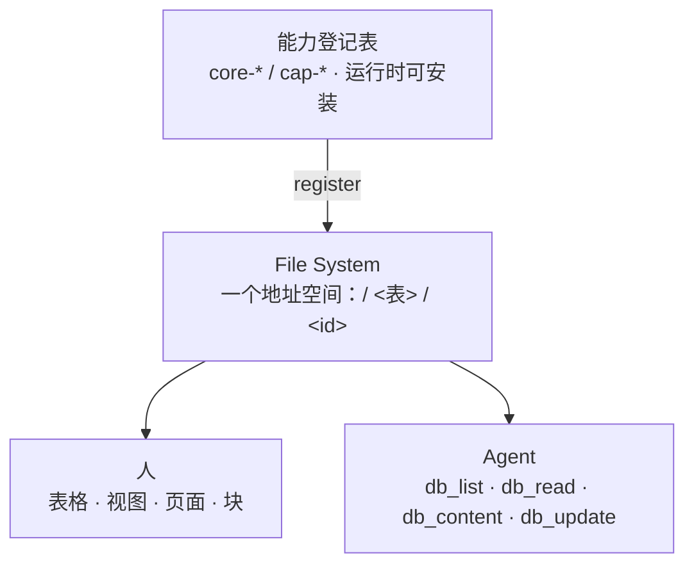
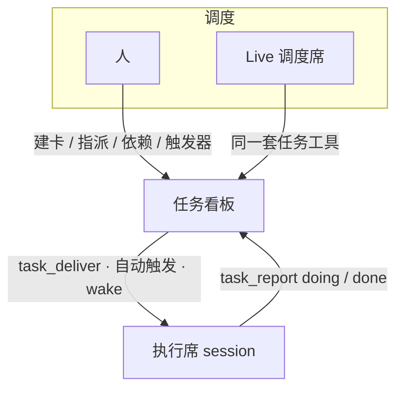
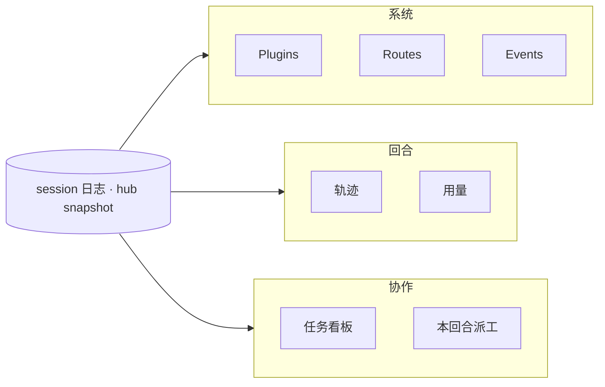
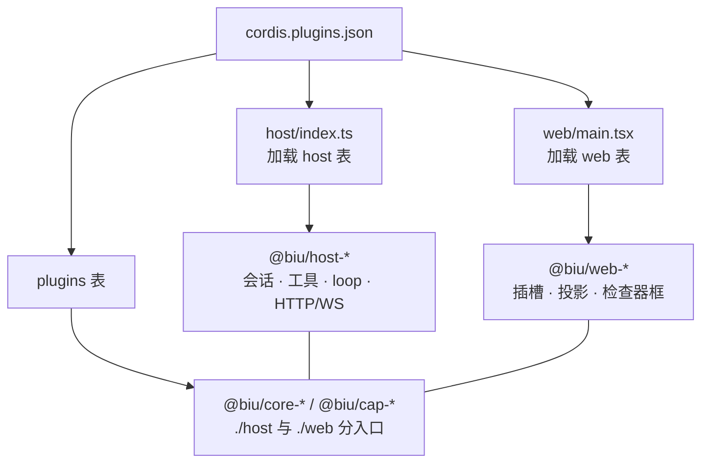

<div align="center">

<p>
  
</p>

# Biu Agent OS

[English](README.md) · **简体中文**

可插拔、自托管，一切皆文件的 Agent OS。

</div>

<p align="center">
  
  
  
  
</p>

**Biu Agent OS** 是一套把 Agent 当进程、把任务看板当协作总线、把**文件系统当作共同记忆**的本地工作台。每个 Agent 是独立 session（各自拥有工作区、模型、工具集），由看板协调多 Agent 协作。两者之下，是一套贯穿整个工作区的 **File System**：每张表、每个页面、每个块、每个视图、每个合集、每个插件都落在一条路径上，人和 Agent 都能寻址。内核基于 Cordis：HTTP、会话、LLM、对话、看板、文件系统……一律是插件，由一份清单 [`cordis.plugins.json`](cordis.plugins.json) 承载。

---

## 目录

- [设计原则](#设计原则)
- [文件系统](#文件系统)
  - [一切皆路径](#一切皆路径)
  - [块：可安装的页面内容](#块可安装的页面内容)
  - [合集：一条记录，多重归属](#合集一条记录多重归属)
  - [反向索引：同类数据一次收集](#反向索引同类数据一次收集)
  - [一切皆文件：Agent 的上下文](#一切皆文件agent-的上下文)
- [产品演示](#产品演示)
- [多 Agent 协作](#多-agent-协作)
- [可观测性](#可观测性)
- [架构](#架构)
- [仓库目录](#仓库目录)
- [快速开始](#快速开始)
- [许可](#许可)

---

## 设计原则

| 原则 | 核心 |
| --- | --- |
| 一切即插件 | 内核与能力分层解耦；每个能力只声明它注入的服务 |
| 一切皆文件 | 表、页面、块、视图、插件都在路径上；人与 Agent 共用一个地址空间 |
| Agent 原生 | 用 Agent 治理 Agent：建、标、查、派皆可编程 |
| 多 Agent 协作 | Agent 是独立 session；看板是它们之间的总线 |
| 极致可溯源 | 一条 append-only 事件流记录一切；所有界面都是它的投影 |

### 1. 一切即插件

基于 Cordis：每个能力只声明它注入的服务；卸载某个能力即移除其功能——壳只识别插槽，不理解业务概念。

### 2. 一切皆文件

一个页面是一个 Markdown 文件；页面里的一个块是一段围栏记录；一张表是一条路径；一行记录是一条路径；一个视图、一个合集、一个已安装插件——全都是路径，由同一套 File System 提供。不存在第二层「只给人看」的数据：你点到的，就是 Agent 用 `db_list` / `db_read` 读到的。

### 3. Agent 原生

Agent 是产品的一等操作对象：可编程地新建、打标签、巡检、派工其他 Agent，并用与人相同的工具面读取工作区。

### 4. 多 Agent 协作

每个 Agent 是独立 session，看板是它们之间的总线；建卡、指派、派工、`task_report` 都发生在看板上。

### 5. 极致可溯源

一条 append-only 事件流记录一切动作；观察与执行共享同一份事实，所有界面都是它的投影。Session 是权威日志——投影可换，日志不能丢。

---

## 文件系统

File System 是整个产品的底座。它不是挂在聊天应用旁边的文件浏览器，而是一层**可插拔的记录层**：能力自己登记表，人（界面）和 Agent（`db_*` 工具）通过同一份契约访问同一个地址空间。



任何能力都可以登记表；File System 从不硬编码表集合。任务、页面、会话、插件、组件、合集、已保存视图，以及任何 `cap-*` 插件贡献的表，全都出现在同一个根下。

### 一切皆路径

| 路径 | 是什么 |
| --- | --- |
| `/` | 根：所有已登记的表（`db_list /`） |
| `/<表>` | 一张表：schema、caps、已保存视图与行 |
| `/<表>/<id>` | 一条记录：字段、合集、正文、附件 |
| `/<表>/<id>`（正文） | 记录的**正文**——真正落盘的文件，用 `db_content` 读写 |
| `/<表>/<id>`（附件） | 记录引用的附件，用 `db_asset` 读写 |

同一批路径也支撑界面：打开一个表格视图、一个检查器面板、一个页面，都是在这套地址空间里导航。不存在「应用里的数据」与「工作区里的文件」之间的导入导出——它们本就是同一个东西。

**两层，一份事实。** 页面正文是真实文件 `.biu/page/<id>.md`（YAML 头 + Markdown），旁边的 SQLite 索引只负责列表与检索；表的行落在 File System 的 SQLite 存储里。能力要用什么，就按同一份契约存，然后出现在同一棵树上。

### 块：可安装的页面内容

页面正文是 Markdown，而 Markdown 里可以携带**块**——一段围栏，渲染成活组件：

```md
:::pageBlock {kind=algorithm plugin=page-algorithm}
{
  "title": "1. Two Sum",
  "difficulty": "Easy",
  "prompt": "……",
  "lang": "python",
  "code": "……"
}
:::
```

块不是写死的组件类型。任何已安装插件都可以 `pageEditor.registerBlock({ kind, plugin, View, … })`，然后得到：

- `/` 斜杠菜单里的入口（自成一组，或并入内置「基础模块」）；
- 页面里渲染出的组件；
- `/page-blocks` 表里的一条记录（id 为 `<pageId>::<blockId>`）——于是块可以**从页面之外**被查询和编辑：标题、类型、插件、数据都是字段。

这就是与常规文档编辑器的分野：内容不是编辑器私有的封闭文本块。组件像插件一样安装、像插件一样版本化、像普通记录一样被 Agent 读取。当前工作区里已经在跑的 HTML 块（静态 + 可跑脚本的 iframe）、Excalidraw 画板、算法题卡片，全都是这样装进来的——仓库里一个都没有，全在运行时安装。

从 Agent 侧改块就是一次普通写入：

```bash
db_list   /page-blocks                     # 工作区里所有内嵌组件
db_update /page-blocks/<pageId>::<blockId> # 改块的 data（默认合并）
```

### 合集：一条记录，多重归属

一条记录是一个对象，但它很少只属于一种分类。标签、类别、奖项、项目归属——那是同一条记录在不同镜片下的样子。

**合集**（`/facets`）是工作区级定义，可以贴到**任意表**的**任意记录**上，并携带该合集自己的属性：

```bash
# 单个合集：values 扁平
db_update /movies/dune {tags:["facet-2"], values:{导演:"丹尼斯·维伦纽瓦"}}

# 多个合集：values 按合集 id 分组
db_update /movies/dune {tags:["facet-2","awards"], values:{"facet-2":{导演:"…"}, awards:{oscar:true}}}
```

合集有自己的 schema（`fields`）、自己的已保存视图、自己的成员清单，而且从不把记录从定义它的表里抢走。同一部电影可以同时是「科幻」项、「2021 年上映」项和「奥斯卡获奖」项，每个合集各带只在自己镜片下才有意义的属性。

### 反向索引：同类数据一次收集

两个反向索引让横向问题变便宜：

- **合集索引** —— `facet_stamps(facet_id, collection, record_id, title)`：给定一个合集，直接返回工作区内所有贴过它的记录，不扫表。这就是「把打了 X 的所有东西给我」的跨表数据路径，也是合集成员清单的底座。
- **页面块索引** —— `/page-blocks` 会遍历页面文件，把每个内嵌块抽取成一行（页面、块 id、类型、插件、标题、数据）。每一拍只重扫最近改动过的页面、绝不全量重建，于是页面的内容无需重新解析整个工作区，就能作为结构化记录被查询。

两个索引都是**派生物**：文件（页面 Markdown、记录的合集）才是事实，索引只是投影，随时可重建。正因如此，Agent 才能问一个工作区级的问题，并得到工作区级的答案。

### 一切皆文件：Agent 的上下文

这就是回报。因为整个产品共用一个路径空间，Agent 的上下文不是手工拼装的——它是读出来的：

| Agent 想…… | 它调用 |
| --- | --- |
| 看有什么 | `db_list /` —— 每张表，附带**写给 Agent 看**的 `blurb` 说明书 |
| 了解一张表的形状 | `db_stat /<表>` —— schema、caps、可用动作 |
| 读数据 | `db_list /<表>`、`db_read /<表>/<id>` |
| 读正文 | `db_content /<表>/<id>` |
| 读附件 | `db_asset /<表>/<id>` |
| 写 | `db_create`、`db_update`、`db_delete`、`db_content`、`db_asset` |
| 执行动作 | `db_action /<表>/<id>` —— 登记方声明的、按表提供的动词 |

让它成为「Agent 原生」而不只是「机器可读」的，是两点：

1. **表会自我介绍。** 每个集合登记一段 `view.blurb`，用散文告诉 Agent：这张表是什么、该用哪条 `db_*`、下一步常见动作是什么、**不要**做什么。`db_list /` 是一张自述的地图，不是一串冷冰冰的名字。
2. **读写对象和界面看到的是同一批。** 不存在一个形状与产品自身状态不同的「Agent API」。Agent 写的就是你看到的；你在屏幕上点中的东西是一个真实句柄（`kind` + `id`，可带 `action`/`plugin`），指向同一批路径。

结果是：人和 Agent 都能在这套工作区里导航。人点表、点视图、点页面、点块；Agent 列、读、写同样的节点。Agent 的上下文成本就是 `db_list` + `db_read`，而不是一条定制摄取管道。

---

## 产品演示

三图覆盖同一套工作面：任务看板、执行席的回合轨迹与 token 用量。

<p align="center">
  
</p>
<p align="center"><sub><code>task.png</code> — 多 Agent 在看板上汇报：chat 中进度回传，队列内待办 / 已完成保持对应</sub></p>

<p align="center">
  
</p>
<p align="center"><sub><code>trajectory.jpg</code> — 检查器「轨迹」以事件投影还原单回合完整过程：模型输出、tool 调用、审批、派工</sub></p>

<p align="center">
  
</p>
<p align="center"><sub><code>usage.jpg</code> — 检查器「用量」展示 token 消耗；<code>task_report</code> 会固化当回合用量</sub></p>

---

## 多 Agent 协作

执行席是独立 session，看板是它们之间的总线。



Live 负责**现场**（谁在运行、是否再次 wake）；看板负责**工作项**（事项归属、卡在何处、何时再派）。两者都写进同一套 File System——看板本身也只是另一张表，任务可以像其他一切一样被 `db_*` 读取、筛选、驱动。

### 首次上手的流程

1. 开一个 **Live** 会话作为调度席，再开一个或多个 **chat** 作为执行席。
2. 在侧栏打开 **Tasks**，建卡，把负责人指派到某个执行席 session。
3. 由人或调度席 `task_deliver`（或通过 cron / `dep:done` / `turn:end` 触发）将执行席 wake 起来。
4. 执行席执行任务，每回合调用 `task_report`：进行中传 `doing`，完成后传 `done`（进度、说明、当回合用量会记录在卡上）。
5. 右侧检查器同时查看 **轨迹** 与对应的 **任务**。上游 `done` 可自动触发下游。

### 人与 Agent 面对的是同一块看板

| | 人 | Agent |
|--|--|--|
| 建卡 / 改负责人 / 看阻塞 | Tasks UI | `tasks_list` · `tasks_update` |
| 派给某个 session | 指派 `assigneeSessionId` | 同上；执行席必须是真 session，不是角色名 |
| 开工 | 触发器或手动 | `task_deliver` |
| 回报 | 看板上的报告时间线 | `task_report` |
| 现场指挥 | 切到对方会话 | Live：`session_wake` / `session_inject` |

依赖是一种图结构：由 `parentId` / `dependsOn` 派生阻塞链。触发器共用同一套状态机：`idle → pending → delivered → done`。删除执行席 session 后，卡上的 report 记录仍会保留。

---

## 可观测性

Harness 在运行时表面即可回答四件事：**装了什么、刚 dispatch 了什么、这一回合做了什么、协作停在哪一步**——无需事后翻日志。



| 层 | 问题 | 入口 |
|----|------|------|
| 系统 | 哪个插件在跑、能否热卸 | Settings → Plugins |
| 系统 | host 暴露了哪些 HTTP | Settings → Routes |
| 系统 | Cordis 刚刚 dispatch 了什么 | Settings → Events（滤掉 stream chunk） |
| 回合 | 模型 / 工具逐步做了什么 | 检查器 **轨迹**（事件投影，不是另存聊天） |
| 回合 | token 怎么花的 | 检查器 **用量**；`task_report` 会固化当回合消耗 |
| 协作 | 谁在做哪张卡 | Tasks + 检查器任务页；Live 对话里的派工表 |
| 协作 | 这套工具对当前 session 是否有效 | 会话配置 / `GET /api/sessions/:id/inspector` |

插件装卸立刻反映到 snapshot（插件表、路由、工具名）。UI 只负责订阅，不自行推断。

---

## 架构



- **壳只依赖插槽。** `composer`、`inspector-panels`、`app-modules`、Settings 各栏由能力自己 `place`。File System 等页面是 cap 注册的模块。
- **Agent loop 可替换。** `agents` 句柄不变，factory 可换。
- **File System 是契约，不是组件。** `@biu/type-file-system` 定义 `CollectionSpec`；`core-file-system` 提供实现；任何能力按它登记表。
- **审批位于管线上。** 敏感 tool 进入 hold 状态，审批 UI 停靠在 dock，不并入壳逻辑。

| 表 | 谁加载 | 能否热卸 |
|----|--------|----------|
| `host` | `host/index.ts` | 否（内核） |
| `web` | `web/main.tsx` | 否（壳） |
| `plugins` | hub + ui-hub | 是 |

加能力：`packages/cap-<id>`，`exports` 分开 `./host` 与 `./web`，写入 `plugins` 表后重启。`type-*`、`public-*` 不要进表。细则：[docs/plugin-packages.md](docs/plugin-packages.md)。

---

## 仓库目录

根目录只保留加载器与清单；能力全部位于 `packages/`，按前缀即可清晰区分。

```
biu
├── host/                      # Node 加载器：读 json 的 host 表，plugin()
│   ├── index.ts
│   └── types.ts
├── web/                       # 浏览器加载器：读 json 的 web 表
│   ├── main.tsx
│   ├── style.css
│   └── types.ts
├── index.html                 # Vite 入口 → web/main.tsx
├── cordis.plugins.json        # 唯一插件清单（host / web / plugins 三张表）
├── Makefile                   # make / make stop / make restart
├── vite.config.ts
├── LICENSE                    # Apache License 2.0
├── NOTICE.md                  # Apache NOTICE：版权、Grok Bot、第三方依赖
├── docs/
│   ├── plugin-packages.md     # 包前缀与入口约定
│   └── demo/                  # README 截图：task / trajectory / usage
├── scripts/
│   └── link-cordis-plugins.mjs
├── public/
│   ├── favicon.svg            # 品牌小人（白底方标）
│   ├── brand-lockup.svg       # README：小人 + Biu Agent OS tag
│   ├── mascot-blue.svg        # README 吉祥物（BMW M 三色）
│   ├── mascot-violet.svg
│   ├── mascot-red.svg
│   └── grok-bot/              # 不在 LICENSE 内：xAI 角色几何副本
└── packages/
    ├── type-session/          # 契约，不进 json
    ├── type-http/
    ├── type-slots/
    ├── type-agent-loop/
    ├── type-host-context/
    ├── type-file-system/      # CollectionSpec：File System 契约
    │
    ├── host-plugin-loader/    # 解析 json、Vite virtual 模块
    ├── host-http/             # HTTP / WS
    ├── host-session-store/
    ├── host-sessions/         # append-only session + ALS
    ├── host-tools/
    ├── host-llm/
    ├── host-system-prompt/
    ├── host-fs/
    ├── host-sandbox/
    ├── host-subprocess/
    ├── host-shell/
    ├── host-jobs/
    ├── host-mcp/
    ├── host-terminal/
    ├── host-lsp/
    ├── host-context/
    ├── host-approvals/
    ├── host-agent-loop/
    ├── host-agents/
    ├── host-subagents/
    ├── host-live-sessions/    # Live 派工（不是任务插件）
    ├── host-hub/              # 挂 plugins 表、snapshot
    │
    ├── web-slots/
    ├── web-app-modules/
    ├── web-session-view/
    ├── web-project-view/
    ├── web-snapshot/
    ├── web-react-host/
    ├── web-app-shell/         # 应用壳、检查器框
    ├── web-plugin-tree/       # Settings → Plugins
    ├── web-event-log/         # Settings → Events
    ├── web-routes-panel/      # Settings → Routes
    ├── web-ui-hub/
    ├── public-mascot/         # 共享吉祥物 UI，不进 json
    ├── public-ui/             # 共享零件（折叠/计数/菜单），不进 json
    │
    ├── core-file-system/      # File System：登记表 + db_* 工具 + UI
    ├── core-editor/           # 记录正文编辑器；块、引用、斜杠菜单
    ├── core-plugin-system/    # 已安装插件、安装卸载、沙箱 + pack
    ├── core-task-system/      # 任务数据、心跳、派工 / 汇报 + 任务表
    ├── core-chat/             # 会话表 + 轨迹 / 用量
    ├── core-page/             # 页面表 + 页面块反向索引
    ├── core-pick/             # 点选数据句柄
    │
    ├── cap-logger/
    └── cap-mascot-easter-egg/
```

每个 `host-*` / `web-*` / `core-*` / `cap-*` 源码在 `src/host/` 和（或）`src/web/`。`core-*` / `cap-*` 的 `package.json` 必须分开 `exports["./host"]` 与 `exports["./web"]`。

---

## 快速开始

需要 Node.js 20+ 和 npm。`main` 与开发分支 `hmr-dev` 当前对齐。

```bash
git clone https://github.com/helloooooooooooooo97/biu.git
cd biu
make          # 安装依赖，同时起 host 与 Vite
```

| | 地址 |
|--|------|
| UI | http://127.0.0.1:5173 |
| API / WS | http://127.0.0.1:3141 |
| 局域网只读分享 | `http://<局域网IP>:3142/share/...`（工作台仍只在本机） |

未配置 Key 时，发送消息只会得到本地回声。请点击输入框旁的 **＋ 配置模型**，或：

```bash
export DEEPSEEK_API_KEY=...     # 或 OPENAI_API_KEY / ANTHROPIC_API_KEY
export CHAT_MODEL=deepseek-chat # 可选
```

配置完成后，按 [首次上手的流程](#首次上手的流程) 启动 Live 与执行席，再到 Tasks 建卡。

<details>
<summary>命令与环境变量</summary>

| 命令 | |
|------|--|
| `make` / `make restart` | 安装并起两侧 / 先停再起 |
| `make host` / `make web` | 只起一侧 |
| `make stop` | 释放 `3141` / `3142` / `5173` |
| `npm test` | Vitest |
| `npx tsc --noEmit` | 类型检查 |

也可：`npm run dev:host` 与 `npm run dev:web`。

| 变量 | 默认 | |
|------|------|--|
| `PORT` / `HTTP_HOST` | `3141` / `127.0.0.1` | 本机工作台（不要改成 `0.0.0.0`，否则整站进局域网） |
| `SHARE_PORT` / `SHARE_HOST` | `3142` / `0.0.0.0` | `make` / `npm run dev` 默认打开；只放行分享页。`SHARE_PORT=0` 关闭 |
| `SHARE_PUBLIC_URL` | 自动探测局域网 IPv4 | 复制链接用的 origin，例如 `http://192.168.1.8:3142` |
| `SHARE_PROXY_UI` | `dev:host` 默认指向 Vite | 开发时分享页走 `5173`；`npm start` 用构建产物 |
| `CORDIS_WORKSPACE` | `.workspace` | 默认工作区 |
| `DEEPSEEK_API_KEY` 等 | | 也可只在 UI 里存 |

</details>

---

## 许可

本版本起，仓库里 **Biu Agent OS 自己写的代码和文档** 使用 [Apache License 2.0](LICENSE)：

- **免费使用、修改、分发、商用**，无传染性，可嵌进闭源产品，不必再申请单独商用授权。
- **专利授权：** 贡献者把其贡献必然侵犯的相关专利一并授出，使用者不被这些专利诉讼要挟；若你就本作品提起专利诉讼，该专利许可终止（Apache-2.0 第 3 条）。
- **NOTICE 义务：** 再分发须保留 [NOTICE.md](NOTICE.md) 与许可文本；改过的文件须标明「已修改」（Apache-2.0 第 4 条）。

此前以 MIT 或 PolyForm Noncommercial 发布的快照仍按当时条款。本树之后适用 Apache-2.0。

**例外：Grok Bot 机器人。** `public/grok-bot/` 里的几何、动画和角色外形 **不是** Apache-2.0 的 Biu 源码，权利属于 xAI 等权利人。说明见 [NOTICE.md](NOTICE.md)。

软件「按原样」提供，作者不承担质量担保。
