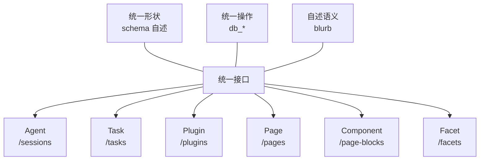
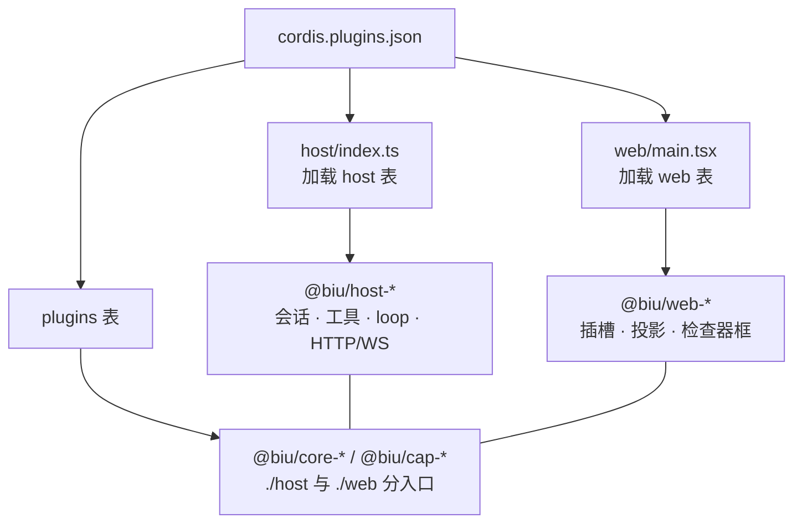

<div align="center">

<p>
  
</p>

# Biu Agent OS

[English](README.md) · **简体中文**

<p>
  <strong>人类与 AI 协同的最终范式。</strong><br />
  <strong>加速创造、存储、排列、组合与分发。</strong>
</p>

<p>
  <em>“与其问 BIU 能做什么，不如想想 BIU 不能做什么。”</em>
</p>

</div>

<p align="center">
  
  
  
  
</p>

---

## 产品演示

<p align="center">
  
</p>
<p align="center"><sub><code>file-system.png</code> — 会话和页面都是同一工作区里的普通表，共用同一套操作方式与地址空间；分栏视图让不同集合可以并排查看</sub></p>

<p align="center">
  
</p>
<p align="center"><sub><code>component.png</code> — 页面组合可复用的视频块；同一个组件也能在专用编辑器中打开，同时呈现预览、时间线、源码声明与终端</sub></p>

<p align="center">
  
</p>
<p align="center"><sub><code>context.png</code> — 页面、会话、插件等工作区项目以可移除的上下文标签加入输入框，让 Agent 准确获取本次对话所选的资料</sub></p>

---

## 为什么是 File System？

多数 Agent 产品把对话、内容和工具分散在不同系统里。Agent 生成的结果留在聊天记录中，下次使用时还要重新查找、解释或生成。

Biu 把页面、表格、任务、技能、插件以及 Agent 本身放进同一个工作区。人通过界面操作，Agent 通过统一接口读取和修改；双方面对的是同一份数据，而不是两套需要同步的副本。

这层共享的数据与操作模型叫做 **File System**。它不是附加在应用旁边的文件浏览器，而是整个工作台的底座：每张表、每个页面、每个块、每条记录都有可寻址的路径。

> “Good artists copy; great artists steal.”（优秀的艺术家模仿，伟大的艺术家剽窃。）乔布斯曾引用这句常被归于毕加索的话。Biu 取的是其中“吸收并重组灵感”的意思：不照搬产品功能，而是借鉴底层模型，再组合成自己的系统：

| 借自 | 借什么 |
|---|---|
| **Linux** | 内核模型——一切皆路径、统一系统调用（`db_action` 之于 `ioctl`、`blurb` 之于 `/proc`） |
| **K8s** | 声明式——块声明期望状态，插件可装卸 |
| **Cursor** | Agent 原生——但更进一步：Agent 自己也是数据 |
| **Notion** | 块模型——但块类型由可安装插件提供，不局限于内置组件 |

> 实现上，内核基于 [Cordis](https://github.com/cordiverse/cordis)，插件注册由一份清单 [`cordis.plugins.json`](cordis.plugins.json) 统一管理。插件负责注册新表与能力；File System 则提供贯穿整个工作台的共享数据模型和操作接口。

---

## 目录

- [产品演示](#产品演示)
- [为什么是 File System？](#为什么是-file-system)
  - [设计源流](#设计源流)
- [设计原则](#设计原则)
  - [一、更少的原子，更多的组合](#一更少的原子更多的组合)
  - [二、一层抽象，统一入口](#二一层抽象统一入口)
- [一、它抽象了什么](#一它抽象了什么)
  - [统一的形状](#1-统一的形状)
  - [统一的操作接口](#2-统一的操作接口)
  - [自述的语义](#3-自述的语义)
- [二、于是所有东西都是它的实例](#二于是所有东西都是它的实例)
  - [Agent：人和 Agent 是同一个操作者模型](#agent人和-agent-是同一个操作者模型)
  - [任务：Agent 之间的总线](#任务agent-之间的总线)
  - [插件：系统自己也能延展](#插件系统自己也能延展)
  - [页面：Component 的容器](#页面component-的容器)
  - [Component：声明式的内容单元](#component声明式的内容单元)
  - [合集：维度本身变成数据](#合集维度本身变成数据)
  - [二级对象：同样的接口，更小的能力范围](#二级对象同样的接口更小的能力范围)
- [三、透明：文件是底座，不是牢笼](#三透明文件是底座不是牢笼)
- [四、于是得到了什么](#四于是得到了什么)
  - [创造不是开发者的专属能力](#1-创造不是开发者的专属能力)
  - [上下文是精准注入的](#2-上下文是精准注入的不是猜出来的)
  - [声明式：Agent 可以写期望状态](#3-声明式agent-可以写期望状态而不只是调命令)
  - [内容自带依赖](#4-内容自带依赖分享的是能跑的工作单元)
  - [它是内核，不是应用](#5-它是内核不是应用)
- [五、它解决了什么](#五它解决了什么)
  - [上下文注入：不再靠猜](#1-上下文注入不再靠猜)
  - [省 token：复用，而不是重新生成](#2-省-token复用而不是重新生成)
  - [自进化：有价值的东西会沉淀下来](#3-自进化有价值的东西会沉淀下来)
- [快速开始](#快速开始)
- [架构](#架构)
- [仓库目录](#仓库目录)
- [许可](#许可)

---

## 设计原则

看过产品形态后，再来看它背后的两条设计判断：一条控制**抽象的数量**，另一条统一**使用方式**。

### 一、更少的原子，更多的组合

反例是概念对功能的一一映射——要任务就造「任务」，要文档就造「文档」，要聊天就造「聊天」。N 个功能，N 套机制，加功能就得加概念。

Biu 的原子集很小：

```
路径 · 表 · 记录 · schema · 操作 · blurb
```

其他对象都由这六种原子组合而成：任务、页面、技能、插件、合集、组件、会话、事件……

于是**加一个领域 ≠ 加一套概念，而是用同一套原子再组合一次**。

### 二、一层抽象，统一入口

原子少还不够——如果每个领域各有一套用法，人和 Agent 还是得学 N 遍。

Biu 为任意领域的数据提供同一套操作接口：

```
db_create /<表>
db_update /<表>/<id>
db_list   /<表>
...
```

无论操作哪个领域，命令和调用方式都相同，只有路径不同。**新增领域不需要再设计一套 API**——领域之间的差异由这一层抽象屏蔽。Agent 可以先用 `db_stat` 了解表的结构和能力，再用通用命令读写数据。

### 两条合起来

```
少量原子  +  统一入口
    ↓
加功能不需要新概念，也不需要新用法
    ↓
于是能力可以是数据，Agent 可以扩展 Agent
```

这条原则在正文里反复出现，每次都是同一个动作：

| 场景 | 做了什么 |
|---|---|
| 合集 | 不新增 schema 机制，复用「表」 |
| 页面环境 | 不新增 `env` 字段，复用「属性」 |
| 组件组合 | 组件是有限的原子，页面是无限的配方 |
| 技能文件 | 不新增附件机制，复用目录 + 一个只读派生字段 |

> **注意：这不是「系统很简单」。** 该学的概念仍然要学——路径、表、记录、合集、组件、blurb、投影。
> 它说的是另一件事：**概念和用法的个数，都不随功能增长。**

---

## 一、它抽象了什么

多数系统都要针对每个领域分别实现一套数据读写接口：任务一个 API，文档一个 API，配置一个 API。每增加一个领域，就要增加一套接口，调用方（UI、Agent、脚本）也必须逐一适配。

Biu 将这些分散的接口统一为一个 **File System**。它抽象的不是存储——底层仍可使用 SQLite 或普通文件——**它抽象的是访问方式**：

> 任何领域的数据，都采用相同的结构、操作接口和自述方式。

于是加新能力不需要改上层。**登记一张表，它就和已有的表一样可读、可写、可查。**

### 1. 统一的形状

每张表自述 schema。Agent 不需要预先知道 `/skills` 长什么样：

```
db_stat /skills
  → fields:  title / description / enabled / source / fileList / notes …
  → caps:    list、read、update、create、delete、content
  → actions: enable、disable
```

字段名、类型、可写性、可用动作，全在这一次调用里。**没有硬编码的领域知识。**

### 2. 统一的操作接口

同一套 `db_*` 操作适用于任意表：

| 想做什么 | 操作 |
|---|---|
| 看有什么 | `db_list /` |
| 看一张表的形状 | `db_stat /<表>` |
| 读数据 / 读一行 | `db_list /<表>` · `db_read /<表>/<id>` |
| 读正文 | `db_content /<表>/<id>` |
| 写 | `db_create` · `db_update` · `db_delete` · `db_content` |
| 执行领域动作 | `db_action /<表>/<id>` |

最后一条是关键：**各领域可以自行定义专属动作**。`/tasks` 有 `deliver`（派工）和 `report`（汇报），`/plugins` 有 `sandbox` 和 `pack`。这些动作不是 File System 内置的，而是**由表自行声明**——但调用方式完全相同。

### 3. 自述的语义

光有统一的数据结构和操作接口还不够。Agent 拿到 `/tasks` 和 `/skills` 后，怎么知道该用哪个？

**表自己说。** 每张表登记一段 `view.blurb`，用散文讲清楚：这张表是什么、该用哪条 `db_*`、下一步常见动作、**不要**做什么。

```
$ db_list /
/events      会话时间线日志。每一行是某会话里的一条 seq。只读。
/tasks       可读写的任务行。执行人 assignee 写成另一个代理的会话 id …
/skills      Skill 是独立的一张表。从 GitHub 安装：db_create /skills，带 files[] …
/plugins     这是插件（可安装的小程序），不是代理。用户说「再开一个 agent」
             请去 /sessions db_create，不要在这张表 create。
```

注意最后一条——它**主动纠正误解**。这是 `blurb` 的真正作用：不是文档，是**给 Agent 的操作说明**。

> **统一的数据结构让 Agent 能读，统一的操作接口让 Agent 能执行，自述的语义让 Agent 知道该做什么。**

---

## 二、于是所有东西都是它的实例

因为接口统一了，这些都不是「使用 File System 的模块」，而是**其中的记录**。其中六类是**一级对象**，共同构成工作台的基础对象模型：



每个都回答同样三个问题：**它是什么、人怎么用、Agent 怎么用。**

### Agent：人和 Agent 是同一个操作者模型

`/sessions` 的每一行就是一个 Agent——一个独立 session，有自己的工作区、模型、工具集。

> **Agent 不是文件系统的使用者，它本身就是文件系统里的一个实例。**
> 它用同一套 `db_*` 操作读取其他对象，其他对象也通过同一接口读取它。

这一条决定了整个产品的形态：**你可以像操作数据一样操作 Agent。** 建一个 Agent = `db_create /sessions`；给任务派工 = 把 `assignee` 写成另一个会话 id。

```
$ db_list /sessions                       # 工作区里所有 Agent
$ db_action /sessions/<id> action=inspect # 看它的配置和最近几句对话
$ db_action /sessions/<id> action=status  # 它的上下文用了多少
```
### 任务：Agent 之间的总线

```
/tasks
  status · assignee · dependsOn · reports …
  actions: deliver（派工） · report（汇报）
```

人通过界面建卡、指派负责人和查看阻塞；Agent 则通过同一张表执行派工与汇报。**双方操作的是同一份数据，使用的是同一套接口。**

依赖是由 `parentId` / `dependsOn` 派生的图；触发器共用同一套状态机 `idle → pending → delivered → done`。上游 `done` 自动触发下游。

| | 人 | Agent |
|--|--|--|
| 建卡 / 改负责人 / 看阻塞 | Tasks UI | `tasks_list` · `tasks_update` |
| 派给某个 session | 指派 `assigneeSessionId` | 同上；执行席必须是真 session，不是角色名 |
| 开工 | 触发器或手动 | `task_deliver` |
| 回报 | 看板上的报告时间线 | `task_report` |
### 插件：系统自己也能延展

`/plugins` 也是通过同一接口登记的表，其中每个插件都是一条记录。已安装的（`.plugin`）和开发中的（`.plugin-dev`）并列，**插件开发与打包统一经过 `sandbox` → 写代码 → `pack`**。

```
$ db_action /plugins/<id> action=sandbox   # 建 .plugin-dev/<id>/
$ db_action /plugins/<id> action=pack      # 打进 .plugin/
```

这是一个刻意的约束：**在系统里装东西，也走同一套接口。**
### 页面：Component 的容器

Component 声明自己是什么，但「放在哪、按什么顺序、和谁一起」由 Page 决定。而且 **Page 是这套体系里唯一具备边界的单位**：

| 边界 | 含义 |
|---|---|
| **逻辑** | 块的 id 是 `<pageId>::<blockId>`，天然带命名空间——不同页面的同名块不会相撞 |
| **组织** | 顺序、布局、上下文——一页就是一次实验、一节课、一个项目 |
| **交付** | 分享时以页为单位解析依赖，把插件源码一起带走 |
| **环境** | 页面为内部插件提供一组作用域内的变量——同一份插件，在不同页面里表现不同 |

第三个边界最具体：**孤立的 Component 还谈不上可交付；Page 才让它成为一个自包含、可运行的工作单元。**

第四个边界影响最深：**不同页面天然形成彼此隔离的作用域，因此可以承载多租户场景。**

```
同一个 plugin（一份代码）
    ↓ 挂在不同页面
/页 A  title: 入门练习   tags: [easy, python]
/页 B  title: 算法冲刺   tags: [hard, rust]
    ↓
两种行为，没有第二份实现
```

**页面的属性就是它的环境**——不需要另开一个 `env` 字段。`title`、`tags`、`emoji`，以及这页需要的任何字段，本身就是内部插件共享的环境变量：

```yaml
---
title: 我的练习册
tags: [练习, 哈希表]
emoji: 📘
---
```

插件读取所在页面的属性，因此组件不是一份份复制出来的实现，而是**由页面环境参数化的同一个实现**。这里体现的是页面级的多租户隔离，而不只是配置差异：作用域由页面边界决定，而不是插件自身的属性。这套环境机制也无需另行引入，它自然建立在「一切皆数据」之上。

两个层次都是声明式的：

```
Component  声明「要什么」    kind + plugin + data
Page       声明「怎么排」    围栏的顺序 + 周围的文字
Page       声明「什么环境」  它自己的属性
```

系统负责把两层声明收敛成真实界面。于是**整页也是一段声明**——Agent 造一页 = 写一份声明，不是搭一个界面。

组合也因此不会爆炸：**组件是有限的原子，页面是无限的配方。**

页面正文是真实文件，所以这层容器是透明的：

```
.biu/page/<id>.md     ← YAML 头 + Markdown
.biu/pages.sqlite     ← 只做列表索引，不存正文
```

Markdown 里可以携带**块**——一段围栏，渲染成活组件：

```md
:::pageBlock {kind=algorithm plugin=page-algorithm}
{ "title": "1. Two Sum", "lang": "python", "code": "……" }
:::
```

任何已安装插件都能注册块类型，然后得到三样东西：斜杠菜单入口、页面里渲染的组件、**以及 `/page-blocks` 表里的一条记录**。

**最后一样是分野所在：内容不被封闭在编辑器内部。** 块类型随插件安装，块本身则像普通记录一样由 Agent 查询和修改。工作区里已经在运行的 HTML 块（静态内容和可执行脚本的 iframe）、Excalidraw 画板、算法题卡片，全都通过这种方式在运行时安装，并不随仓库发布。

### Component：声明式的内容单元

页面里的一个**块**（`/page-blocks`）就是一个 Component。它同时是三样东西：

| 层面 | 它是什么 |
|---|---|
| 写法 | 一段声明：`kind` 说明类型，`plugin` 说明谁来渲染，后面是数据 |
| 渲染 | 页面里一个活组件——由插件实现，像插件一样安装和版本化 |
| 数据 | `/page-blocks` 里的一行：`pageId` · `blockId` · `blockKind` · `plugin` · `data` |

第三层是关键：由于块同时也是记录，因此可以在页面之外被读写、查询和聚合。

```
$ db_list   /page-blocks                        # 工作区里所有内嵌组件
$ db_update /page-blocks/<pageId>::<blockId>    # 改块的 data（默认合并）
```

**跨页面聚合**：每条块记录都带有 `plugin` 和 `pageId`，因此只需一次查询，就能知道某类组件出现在哪些页面：

```
$ db_list /page-blocks filter.plugin=page-algorithm
  → 所有页面里所有用这个插件渲染的块
```

这就是「组件」作为一级对象的含义：**它不只活在某一页里，它是工作区里可被聚合的一类数据。** 加上声明式，Agent 不需要写界面代码——写三个字段就够了。

### 合集：维度本身变成数据

上面每一节，schema 都由插件代码定义。但有些维度是**运行时长出来的**——一部电影该不该有「导演」，一个任务该不该有「季度评级」，取决于你此刻在做什么，不该要求先写一个插件。

`/facets` 把这件事翻过来：**维度自己也是表里的行。**

```bash
db_create /facets records=[{title:"获奖"}]                     # 新维度，零代码
db_update /facets/获奖 {fields:[{key:"name",type:"string"},    # 维度自带 schema
                                {key:"year",type:"number"}]}

db_update /movies/dune {tags:["获奖"], values:{name:"奥斯卡",year:2022}}
db_update /tasks/build {tags:["获奖"], values:{name:"季度最佳",year:2022}}
```

三个后果：

1. **新增维度不改代码、不跑迁移。**
2. **一个合集跨所有表**——同一个「获奖」可以贴到电影、任务、页面上。
3. **记录从不离开定义它的表。** 同一部电影可以同时属于「科幻」和「2021 上映」两个合集，每个合集都可以携带只在自身视角下有意义的属性。

这就把两套 schema 的分工摆明了：

| | 定义在 | 负责 |
|---|---|---|
| 表的 schema | 插件代码（静态） | **结构**——这东西是什么 |
| 合集的 schema | 数据（动态） | **视角**——此刻怎么看它 |

> **「无限延展」的确切含义不是 File System 预先知道所有维度，而是它允许维度在运行时作为数据出现。**

合集索引（`facet_stamps`）让「查询所有标记过 X 的记录」无需扫描各业务表：给定一个合集，就能直接返回工作区内所有关联记录。它是派生索引，随时可以重建。

### 二级对象：同样的接口，更小的能力范围

一级对象之外，根下还有几张表。它们没有新机制，只是同一套接口的更多实例——**登记一张表就是加一个领域**，这正是抽象在工作。

| 表 | 是什么 |
|---|---|
| `/skills` | 技能包。一条记录（元数据 + 正文）+ 一个目录（技能自带的文件）。`SKILL.md` 被提取为正文，其余文件存入 `.biu/skill/<id>/`，磁盘状态以只读字段 `fileList` 暴露出来——**三种存储，一套接口** |
| `/mcp` | 外部工具来源。一行 = 一台 MCP 服务器，工具统一用 `mcp_list` / `mcp_call` 访问，不各自变成独立工具 |
| `/views` | 已保存的查询。筛选、排序、复杂条件（`filterTree`）都存成一行 |
| `/events` | 会话时间线。append-only，只读 |
| `/notices` | 给人看的收件箱 |

注意 `/skills` 和 `/mcp` 放在这里，不是因为它们不重要，而是因为它们**不引入新机制**——它们是「登记一张表」这条规则的应用，不是规则本身。

---

## 三、透明：文件是底座，不是牢笼

到这里有个问题该回答了：既然底下是 SQLite、目录、日志，为什么还叫**文件**系统？

因为这层抽象**没有把数据锁在接口后面**。

```
/pages/abc    →  .biu/page/abc.md           真能被编辑器打开
/skills/bento →  .biu/skill/bento/DESIGN.md 真能被 cat 出来
```

你可以只用 `db_*`，也可以直接读盘。**抽象是便利，不是屏障。**

这也明确了「一切皆文件」的含义：它不是对底层存储的字面描述，因为底层仍然是异构的；它表达的是一项**特性**——数据既可通过统一接口访问，也可直接在磁盘上查看。

页面正文存放在 `.biu/page/<id>.md`，旁边的 `.biu/pages.sqlite` 只负责列表与检索；表记录则保存在 File System 的存储中。每项能力可以选择适合自己的底层存储，但都按照同一份接口契约暴露在同一棵树上。

**透明还带来一件事：可溯源。** 一条 append-only 的事件流记录所有动作，所有界面都是它的投影。事件流是权威日志——投影可以替换，日志不能丢。因为你能同时看到「状态」和「状态如何形成」，出现问题时便可以沿着日志追溯。

---

## 四、于是得到了什么

前面讲的是一条链：一个统一接口，所有东西都是它的实例。现在把这条链推到底，看看长出了什么。

### 1. 创造不是开发者的专属能力

这是最直接的一条推论。因为所有东西都是表里的行，而 Agent 能写任何一张表：

```
db_create /sessions   ← 造一个 Agent
db_create /tasks      ← 造一个任务
db_create /pages      ← 造一页内容
db_create /skills     ← 造一个技能
db_create /facets     ← 造一个维度
db_create /plugins    ← 造一个能力（唯一需要 pack 的，因为它是代码）
```

**操作一样，语法一样，只有表名不同。**

在多数系统里，扩展系统和使用系统属于两种不同角色：开发者编写插件，用户安装插件。Biu 不预设这条分界——**人和 Agent 都可以通过同一接口创建系统中的对象**。

系统的边界因此不再只是「开发者预先实现了哪些功能」，还包括「运行时产生了哪些能力」。`plugins` 之所以也必须是一张表，正是为了让这条闭环成立：如果插件只能由开发者编写，Agent 就始终受限于开发者预先提供的能力。

### 2. 上下文是精准注入的，不是猜出来的

人和 Agent 面对同一个地址空间，于是**感知面等于操作面**：

```
人在页面上操作 ──→ 状态变了 ──→ Agent 用同一套 db_* 读到
Agent 改动状态 ──→ 界面渲染  ──→ 人看到
```

Agent 不是被「通知」人的操作，而是**能读到操作留下的结果**——而且是完整的，因为两边用的是同一批路径。你在屏幕上点中的东西是一个真实句柄（`kind` + `id`，可带 `action`/`plugin`），不只是渲染产物。

这让上下文注入不再是「猜该塞什么」：

| 它想知道 | 读哪里 |
|---|---|
| 我在哪 | 当前页面 / 当前记录 / 选中的块 |
| 我在做什么 | 块数据、记录字段、任务状态 |
| 我为什么在这 | `assignee` / `dependsOn` / `reports` |
| 之前发生了什么 | `/events` |
| 还有谁在场 | `/sessions`、`/tasks` 的协作图 |

**成本只与实际需要读取的数据量相关，而不是与全部数据量相关。** 不需要定制的数据摄取管道，也不需要为了让 Agent 理解而维护第二份数据。

### 3. 声明式：Agent 可以写期望状态，而不只是调命令

页面里的一个块，就是一段声明：

```md
:::pageBlock {kind=algorithm plugin=page-algorithm}
{ "title": "1. Two Sum", "lang": "python", "code": "……" }
:::
```

`kind` 和 `plugin` 说明它由谁渲染，后面那段 JSON 是它想要的数据。系统负责收敛成界面上真实运行的组件。

**因为它是声明式的，Agent 可以直接写它**——不需要调用某个渲染 API，只需要把期望状态写进去。插件同理：可装卸、可替换，`sandbox` → 写代码 → `pack`。

于是 Agent 有两种动作：**调命令**（`db_action`）和**写声明**（`db_create` / `db_update`）。后者才是让它能造东西的原因。

### 4. 内容自带依赖：分享的是能跑的工作单元

一个页面挂着若干块，每个块来自一个插件，而插件是代码。于是分享一个页面时，被一起带走的不只是内容：

```
页面正文（Markdown）
图片等附件
它引用到的插件源码     ← 一起打包
```

接收方拿到的不只是「一份文档」，而是**一个自包含、能跑起来的工作单元**。

这套依赖关系贯穿三个阶段：写入时**声明**（block 声明 `plugin`）、分享时**解析**（扫描引用并打包）、运行时**挂载**（安装插件并渲染块）。

这也是为什么 `.plugin-dev` 和 `.plugin` 并列在同一张表里——**插件必须和数据同级，才能跟着数据走**。

### 5. 它是内核，不是应用

把这些放回已知的坐标系，它的形态就清楚了：

| | Linux | Biu |
|---|---|---|
| 一切皆路径 | 一切皆文件 | 一切皆 `/<表>/<id>` |
| 系统调用 | `read` / `write` | `db_read` / `db_update` |
| 设备自定义操作 | `ioctl` | `db_action` |
| 自述系统状态 | `/proc` | `db_list /` + `blurb` |
| 驱动注册 | 模块 | 插件登记表 |
| 屏蔽异构 | VFS | File System |

**它不是一个 Agent 应用，而是一个能长出 Agent 应用的内核。**

Cursor 把 Agent 做进了编辑器，Notion 把块做进了文档——它们的核心对象由各自的应用预先定义。Biu 的核心对象则是数据本身：**Agent 是数据，能力是数据，由另一个 Agent 创建的 Agent 也是数据**，因此它们都可以被读写、复制和分享。

这也解释了为什么它必须存在——应用可以有很多个（一个写作台、一个调度台、一个算法练习册），但**它们可以共用同一个内核**。

---

## 五、它解决了什么

Agent 领域有几个一直没解决的问题。这套设计一次性地给了答案——而且**对人类同样成立**。

### 1. 上下文注入：不再靠猜

「该给 Agent 看什么」是 Agent 系统中成本最高的环节之一。常见做法是检索大量可能相关的内容、人工配置规则，或直接推送事件，但上下文命中往往不够准确。

Biu 有两个来源，都不靠猜：

**其一，能力自行登记上下文。** 上下文不是由平台统一生成，而是由每项能力按照统一契约声明并提供——一个块、一张表、一个工具。**这与「登记一张表」采用同一种模式**：谁提供能力，谁就同时说明它会带来哪些上下文。

**其二，环境感知。** Agent 和人读同一个地址空间，于是它看得见人在做什么：

```
人在页面上操作 ──→ 状态变了 ──→ Agent 用同一套 db_* 读到
```

不是被通知，是**能读到操作留下的结果**。

> → **对人**：不用每次重新交代背景。上下文就在页面上，你写到哪，它读到哪。

### 2. 省 token：复用，而不是重新生成

多数 Agent 产品里，让 Agent 产出一个界面 = 让它写几十上百行 HTML / CSS / JS。又贵，又不好看，而且下次还得再写一遍。

Biu 里，让 Agent 产出一个界面 = 写三个字段：

```md
:::pageBlock {kind=algorithm plugin=page-algorithm}
{ "title": "1. Two Sum", "lang": "python" }
:::
```

`kind` 和 `plugin` 指向一个已经存在的插件，剩下的只是数据。**一份插件被 N 个页面复用。**

> → **对人**：迭代页面 ≈ 改一段 JSON，不用重新写一个页面。

### 3. 自进化：有价值的东西会沉淀下来

普通 Agent 的一次好输出，用完就沉进聊天记录里了——下次遇到同样的事，重新生成一遍。

Biu 里它可以**落下来**：变成一页、一个块、一个技能、一张表。因为一切都是数据，沉淀不需要额外机制，它就是一次普通的写入。

系统因此能一轮轮长起来，而不是每轮归零。

> → **对人**：你写下的内容也会留在同一个地方。**人和 Agent 共享同一份积累**——今天交给 Agent 的知识，明天依然可用，而且你可以清楚地看到它存放在哪里。

---

## 快速开始

需要 Node.js 20+ 和 npm。`main` 与开发分支 `hmr-dev` 当前对齐。

```bash
git clone https://github.com/helloooooooooooooo97/biu.git
cd biu
make          # 安装依赖，同时起 host 与 Vite
```

| | 地址 |
|--|------|
| UI | http://127.0.0.1:5173 |
| API / WS | http://127.0.0.1:3141 |
| 局域网只读分享 | `http://<局域网IP>:3142/share/...`（工作台仍只在本机） |

未配置 Key 时，发送消息只会得到本地回声。请点击输入框旁的 **＋ 配置模型**，或：

```bash
export DEEPSEEK_API_KEY=...     # 或 OPENAI_API_KEY / ANTHROPIC_API_KEY
export CHAT_MODEL=deepseek-chat # 可选
```

首次使用时：

1. 打开一个 **Live** 会话作为调度席，再打开一个或多个 **chat** 会话作为执行席。
2. 从侧栏进入 **Tasks**，新建任务并将负责人指派给某个执行会话。
3. 由人或调度会话派发任务以唤醒执行会话；执行会话在每轮结束时汇报进展。
4. 在右侧检查器中查看执行**轨迹**及其对应的**任务**。

<details>
<summary>命令与环境变量</summary>

| 命令 | |
|------|--|
| `make` / `make restart` | 安装依赖并启动 host 与 web / 停止后重新启动 |
| `make host` / `make web` | 仅启动 host / 仅启动 web |
| `make stop` | 释放 `3141` / `3142` / `5173` |
| `npm test` | Vitest |
| `npx tsc --noEmit` | 类型检查 |

也可：`npm run dev:host` 与 `npm run dev:web`。

| 变量 | 默认 | |
|------|------|--|
| `PORT` / `HTTP_HOST` | `3141` / `127.0.0.1` | 本机工作台（不要改成 `0.0.0.0`，否则整个站点会暴露到局域网） |
| `SHARE_PORT` / `SHARE_HOST` | `3142` / `0.0.0.0` | `make` / `npm run dev` 默认打开；只放行分享页。`SHARE_PORT=0` 关闭 |
| `SHARE_PUBLIC_URL` | 自动探测局域网 IPv4 | 复制链接用的 origin，例如 `http://192.168.1.8:3142` |
| `SHARE_PROXY_UI` | `dev:host` 默认指向 Vite | 开发时分享页走 `5173`；`npm start` 用构建产物 |
| `CORDIS_WORKSPACE` | `.workspace` | 默认工作区 |
| `DEEPSEEK_API_KEY` 等 | | 也可只在 UI 里存 |

</details>

---

## 架构



- **壳只依赖插槽。** `composer`、`inspector-panels`、`app-modules` 以及 Settings 各栏均由能力自行放置。File System 等页面则是由 cap 注册的模块。
- **Agent loop 可替换。** `agents` 句柄不变，factory 可换。
- **File System 是契约，不是组件。** `@biu/type-file-system` 定义 `CollectionSpec`；`core-file-system` 提供实现；任何能力按它登记表。
- **审批位于执行管线上。** 敏感工具进入待审批状态，审批界面停靠在 dock 中，不并入壳逻辑。

| 表 | 谁加载 | 能否热卸 |
|----|--------|----------|
| `host` | `host/index.ts` | 否（内核） |
| `web` | `web/main.tsx` | 否（壳） |
| `plugins` | hub + ui-hub | 是 |

如需添加能力，请创建 `packages/cap-<id>`，分别定义 `./host` 与 `./web` 的 `exports`，将其登记到 `plugins` 表中，然后重启。`type-*` 和 `public-*` 不应登记到该表。细则见 [docs/plugin-packages.md](docs/plugin-packages.md)。

---

## 仓库目录

根目录只保留加载器与清单；能力全部位于 `packages/`，按前缀即可清晰区分。

```
biu
├── host/                      # Node 加载器：读 json 的 host 表，plugin()
│   ├── index.ts
│   └── types.ts
├── web/                       # 浏览器加载器：读 json 的 web 表
│   ├── main.tsx
│   ├── style.css
│   └── types.ts
├── index.html                 # Vite 入口 → web/main.tsx
├── cordis.plugins.json        # 唯一插件清单（host / web / plugins 三张表）
├── Makefile                   # make / make stop / make restart
├── vite.config.ts
├── LICENSE                    # Apache License 2.0
├── NOTICE.md                  # Apache NOTICE：版权、Grok Bot、第三方依赖
├── docs/
│   ├── plugin-packages.md     # 包前缀与入口约定
│   └── demo/                  # README 截图：file-system / component / context
├── scripts/
│   └── link-cordis-plugins.mjs
├── public/
│   ├── favicon.svg            # 品牌小人（白底方标）
│   ├── brand-lockup.svg       # README：小人 + Biu Agent OS tag
│   ├── mascot-blue.svg        # README 吉祥物（BMW M 三色）
│   ├── mascot-violet.svg
│   ├── mascot-red.svg
│   └── grok-bot/              # 不在 LICENSE 内：xAI 角色几何副本
└── packages/
    ├── type-session/          # 契约，不进 json
    ├── type-http/
    ├── type-slots/
    ├── type-agent-loop/
    ├── type-host-context/
    ├── type-file-system/      # CollectionSpec：File System 契约
    │
    ├── host-plugin-loader/    # 解析 json、Vite virtual 模块
    ├── host-http/             # HTTP / WS
    ├── host-session-store/
    ├── host-sessions/         # append-only session + ALS
    ├── host-tools/
    ├── host-llm/
    ├── host-system-prompt/
    ├── host-fs/
    ├── host-sandbox/
    ├── host-subprocess/
    ├── host-shell/
    ├── host-jobs/
    ├── host-mcp/
    ├── host-terminal/
    ├── host-lsp/
    ├── host-context/
    ├── host-approvals/
    ├── host-agent-loop/
    ├── host-agents/
    ├── host-subagents/
    ├── host-live-sessions/    # Live 派工（不是任务插件）
    ├── host-hub/              # 挂 plugins 表、snapshot
    ├── host-skills/           # /skills 表：技能包 + 文件目录
    │
    ├── web-slots/
    ├── web-app-modules/
    ├── web-session-view/
    ├── web-project-view/
    ├── web-snapshot/
    ├── web-react-host/
    ├── web-app-shell/         # 应用壳、检查器框
    ├── web-plugin-tree/       # Settings → Plugins
    ├── web-event-log/         # Settings → Events
    ├── web-routes-panel/      # Settings → Routes
    ├── web-ui-hub/
    ├── public-mascot/         # 共享吉祥物 UI，不进 json
    ├── public-ui/             # 共享零件（折叠/计数/菜单/附件），不进 json
    │
    ├── core-file-system/      # File System：登记表 + db_* 工具 + UI
    ├── core-editor/           # 记录正文编辑器；块、引用、斜杠菜单
    ├── core-plugin-system/    # 已安装插件、安装卸载、沙箱 + pack
    ├── core-task-system/      # 任务数据、心跳、派工 / 汇报 + 任务表
    ├── core-chat/             # 会话表 + 轨迹 / 用量
    ├── core-page/             # 页面表 + 页面块反向索引
    ├── core-pick/             # 点选数据句柄
    │
    ├── cap-logger/
    └── cap-mascot-easter-egg/
```

每个 `host-*` / `web-*` / `core-*` / `cap-*` 源码在 `src/host/` 和（或）`src/web/`。`core-*` / `cap-*` 的 `package.json` 必须分开 `exports["./host"]` 与 `exports["./web"]`。

---

## 许可

从本版本开始，**Biu Agent OS 项目原创的代码和文档**采用 [Apache License 2.0](LICENSE)：

- **免费使用、修改、分发、商用**，无传染性，可嵌进闭源产品，不必再申请单独商用授权。
- **专利授权：** 贡献者授予实施其贡献所必需的相关专利许可；若你就本作品提起专利诉讼，该专利许可将终止（Apache-2.0 第 3 条）。
- **NOTICE 义务：** 再分发须保留 [NOTICE.md](NOTICE.md) 与许可文本；改过的文件须标明「已修改」（Apache-2.0 第 4 条）。

此前以 MIT 或 PolyForm Noncommercial 发布的快照仍按当时的条款授权。当前代码树及此后的版本均适用 Apache-2.0。

**例外：Grok Bot 机器人。** `public/grok-bot/` 里的几何、动画和角色外形 **不是** Apache-2.0 的 Biu 源码，权利属于 xAI 等权利人。说明见 [NOTICE.md](NOTICE.md)。

软件「按原样」提供，作者不承担质量担保。
